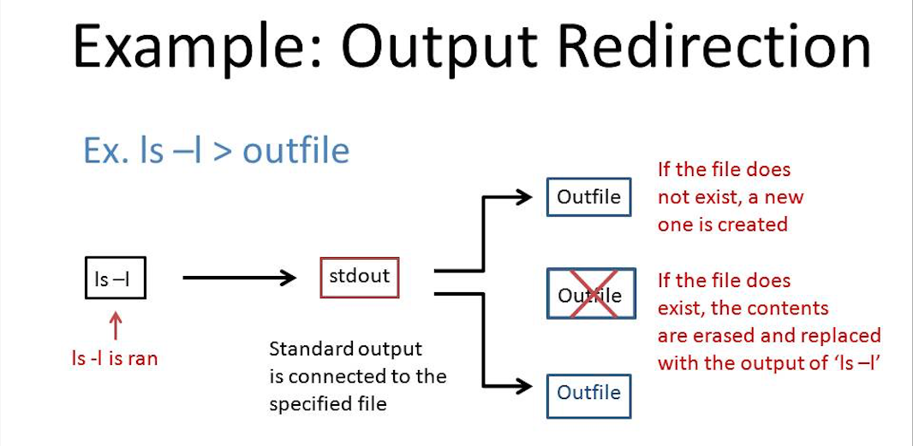
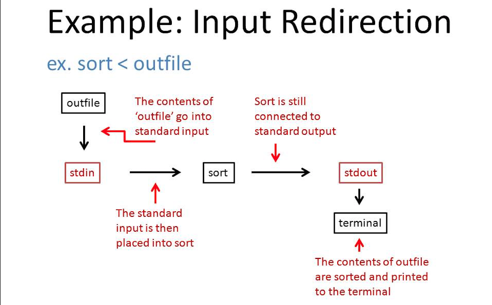
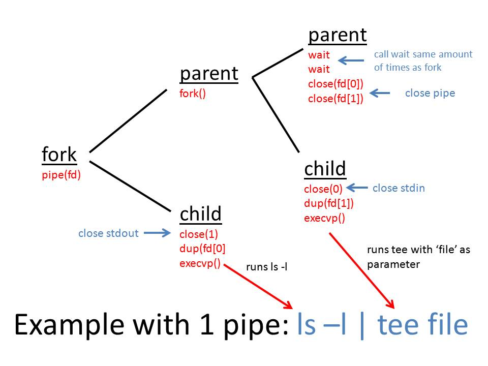

# I/O Redirection and Piping Lab

In this lab you will learn the basics of I/O Redirection and piping in Unix.
There are three exercises, one at the end of the Input Redirection Tutorial, one at the end of the Output Redirection Tutorial, and one at the end of the Piping tutorial.
You will need to demonstrate that all three programs work to your TA.

##Output Redirection

Using I/O Redirection can make programming much faster and simplier.

For example open a terminal change your current directory `/ucr-cs100/assignments/lab/io_piping/` and run:

```bash
$ ls
images  input.cpp  io_sol.cpp  names.txt  output.cpp  piping.cpp  README.md
$ ls > ls.txt
$ ls
images  input.cpp  io_sol.cpp  ls.txt  names.txt  output.cpp  piping.cpp  README.md
```

We can see that the file `ls.txt` did not exist before we ran this command.
To see where the output of our command `ls > ls.txt` went, run the command:

```bash
$ cat ls.txt
images
input.cpp
io_sol.cpp
ls.txt
names.txt
output.cpp
piping.cpp
README.md
```
Notice the output from `ls` was sent to `ls.txt` instead of directly to the terminal.

No, it is not magic! 
But it is pretty useful to help keep track of testing your programs.

To understand how this works, we will first need to know how to use the Unix system calls required to build I/O Redirection: `open()`, `close()`, `dup()`, and `dup2()`.

Refer to the [`dup()/dup2()` man page](https://man7.org/linux/man-pages/man2/dup.2.html "man") for more detailed information or refer to the [textbook](https://github.com/mikeizbicki/ucr-cs100/blob/2015spring/textbook/assignment-help/syscalls/io.md) from the UCR software construction course page on Github.

Refer to the man pages for all the detailed information needed to understand `open()` and `close()` here:

* [`open()` man page](http://linux.die.net/man/2/open "man")

* [`close()` man page](http://linux.die.net/man/2/close "man")

`dup()` and `dup2()` pair with these system calls to make functioning i/o Redirection. To do this you need to:

1. Open the file we want to read from.
2. Close and call `dup()` on stdout.
3. After this is done, do not forget to restore output back to the terminal.

Here is an example to illustrate the output redirection process:




###Output Redirection Exercise:

The program `output.cpp contains code that output's one line to stdout.

Compile and run the provided `output.cpp` file:

```bash
$ g++ output.cpp -o output
$ ./output
This output is printed to the screen.
```

You can use output redirection to print the text to file, like so:
```bash
$ ./output > file
$cat file
This output is printed to the screen.
```

The task of this section of the lab is to modify the file `output.cpp` so the compiled program behaves as if it has undergone output redirection by using the syscalls `open()`, `dup()`, and `dup2()`. 
Make sure to restore stdout after output redirection is finished.

##Input Redirection

Another handy tool computer hackers use to make programming easier is input redirection.
This tool redirects standard input of a file and places it into standard input of a program.

Now make a file using output redirection:
```bash
$ echo "This is the contents of outfile." > outfile.txt 
```
Now run the command:
```bash
$ cat < outfile.txt
This is the contents of outfile.
```

You should see the text we added into `outfile.txt` onto the terminal.
We redirected the text from `outfile.txt` to output to the screen using input redirection.

Let's walk through another example of input redirection.

There is a file in this repository named `names.txt`.
By running this command in the termial, we get:

```bash
$ sort < names.txt
50 Cent
Ann
Beyonce
Dan
Daniel
Diane
Donna
Eminem
Jessica
Julia
Lauren
Leon
Maroon 5
Megan
Michelle
```

Notice the output is sorted!
But when we run:

```bash
$ cat names.txt
Donna
Ann
Dan
Lauren
Daniel
Leon
Beyonce
Eminem
50 Cent
Maroon 5
Julia
Jessica
Diane
Megan
Michelle
```
The contents of our file are still out of order!
This is because we directed ONLY the output of the `names.txt` file into the sort program.

We can implement input redirection similarly to output redirection.

1. First we use the system call `open()` to open our file that we want to read from.
2. Then `close()` and `dup()` or `dup2()` are used to change the input redirection.

Here is an illistration to better understand input redirection:


###Input Redirection Exercise:

The file `input.cpp` contains code that outputs specific text:

Compile and run the program:
```bash
$ g++ input.cpp -o input
$ ./input
i
n
p
u
t
 
r
e
d
i
r
e
c
t
i
o
n
```

Now we want to use this output for input redirection so first place the output of this program into a file named `infile` using output redirection:

```bash
$ ./input > infile
```

Then use input redirection from this file to sort all the characters of the file:

```bash
$ sort < infile
 
c
d
e
e
i
i
i
n
n
o
p
r
r
t
t
u
```
The task of this section of the lab is to modify the file `input.cpp` so the compiled program behaves as if it has undergone input redirection by using the syscalls `open()`, `close()`, `dup()`, and `dup2()`. 

##Piping

Using pipes while programming can make tedious jobs into easy ones.

Here is a quick and useful example of pipes:

Run the command:
```bash
$ history
```

As you can see, this print out many lines onto your terminal.
The `history` bash command shows you all of the commands you have typed into your terminal.
We can filter these results by using the bash `grep` command with the string we want to search for:

If we were looking for `g++`, we would type the command:
 
```bash
$ history | grep 'g++'
```

This filters our results of the history command to only show us lines that have the string `g++` contained in them.

Here is another helpful example:

Say we want to see what processes someone on the same server as you is using.
We need to use bash command [`ps`](http://unixhelp.ed.ac.uk/CGI/man-cgi?ps) to see what processes are running and we add the `-ef` flag to display ALL processes, not just the processes that we are running.

Running this command in our terminal:

```bash
$ ps -ef
```
Note: The output was too long to print to this document.

WHOA, this prints out ALL the processes running on the server to stdout.
We can use pipes to shorten and search the output for something specific using the [`grep`](http://unixhelp.ed.ac.uk/CGI/man-cgi?grep) command.
You can use `grep` with piping to search for a specific username like so:

```bash
$ ps -ef | grep 'username'
```

BOOM!!!
Now only the lines with this specific username in them are printed out to the screen.

You can get a better understanding of how to use the `pipe()` system call in the [UCR cs100 textbook](https://github.com/mikeizbicki/ucr-cs100/blob/2015spring/textbook/assignment-help/syscalls/io.md) or on the [`pipe()` man page](http://linux.die.net/man/2/pipe).

#### Using `pipe()` with `fork()`, `wait()`, and `execvp()`
In your first assignment, you had to use the system calls `execvp()`, `wait()` and `fork()` to run programs in rshell.
We will now expand upon your knowlegde of these system calls with piping to help with the piping assignment.

We need to make sure that `pipe()` is called before `fork()` because we need the pipe to be accessable in both processes.
If we were to call `pipe()` after we call `fork()` the pipe would only be accessable in the first child and not the others.

Every time `fork()` is called, we need to make sure to call `wait()` the same amount of times. 
 
Here is an illistration to better understand how `pipe()` works with `fork()`:



###Piping Exercise: 

Write a program that takes the output from one command and pipes it to the input of a second command.
You will be using the syscalls: `pipe()`, `fork()`, `dup()` or `dup2()`, `open()`, `close()`, `execvp()`, and `wait()` to accomplish this.

Specifically you will handle the case `ps -ef | grep 'username'` where you will first search for your own username, then change the code to search for your partner's username.
The output should be the same as the output from the example above.
