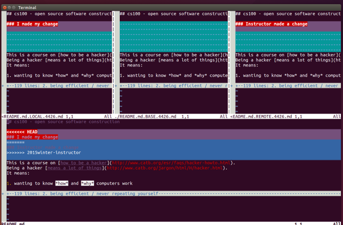
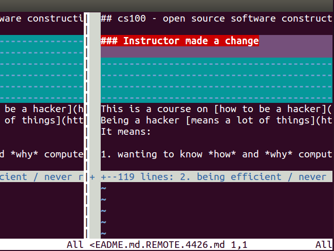
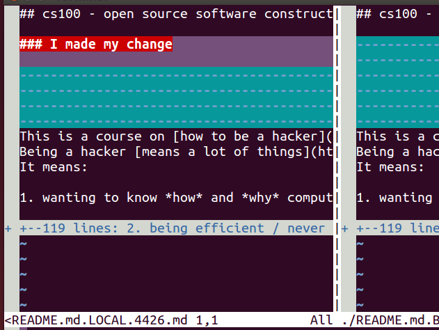
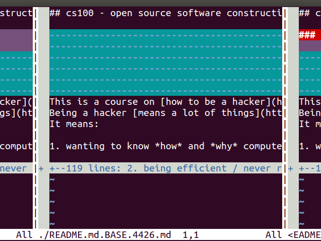
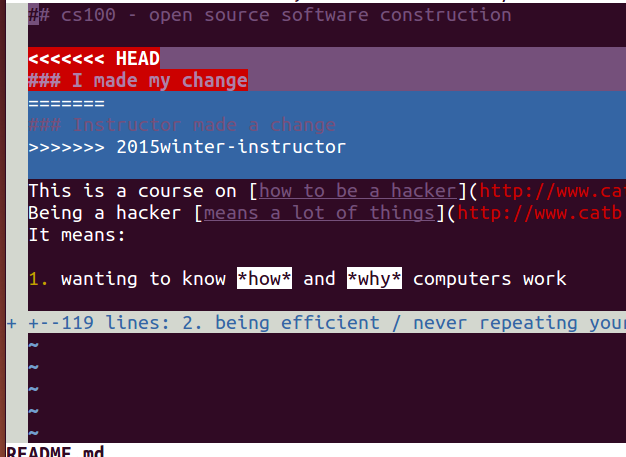

# It's time to swim

In this guide we will go through setting up a cloned git repository to update it from a remote repository.
At the same time we will be establishing a git workflow that keeps our local repository up to date with a remote repository.

*Note:* All text with `<TEXT>` means to replace TEXT with the proper
text/path/name

I assume that you have already forked your repository from mikeizbikis github.
If you have not, here are instruction to [fork](Enrolling.md#forking-your-repo-) the repository.
Start by cloning the class repository from your student github account.
From there checkout the `2015spring` branch, then create and checkout a branch named `2015spring-student`.

##The stream flows both ways

Now that we have cloned the git repository we should set it up for `pushing` and `pulling` from a remote location.
We will use the class project hosted on github as the main class repository. 
The url is https://github.com/mikeizbicki/ucr-cs100.git 

###I think the stream is flowing away from me

Since we cloned the repository from the URL above, we can upload our changes to github using `git push`.
This uploads our version of the repository to a server online or within a local network.
Doing this allows others to see our changes as well as make changes based off of those changes.
    
    $ git push <url> <branch>
    $ git push https://github.com/<your user name>/ucr-cs100.git 2015spring-student

Isn't there a better way to push changes to a repository you ask. Git has what is called a remote
to handle this issue.

####I found another stream attached to this one

First to push to a location that is not identified by a URL you will have to add a remote.
This is a place where versions of the git project are hosted at, online or with a local network.
They are not the actual repository but rather it is a URL to that repository.
Managing remotes are essential to working with different collaborators.
Git uses remotes to allow us to identify what URLs are attached to repository.
Remotes re how git deals with uploading and downloading project versions.
To view the current remotes for the repo issues the `git remote` command

    $ git remote

Notice there is nothing in this output but the remote named origin.

This is the default remote for a cloned repo.
 
This will generally be your personal fork of a repo.
If you cloned from a repository that is not your own, you will need to add a remote to the location that you have push access to, ie. your personal fork on git1hub. 
Now that we see we have a remote lets take a look at where this remote points to. 

To get a little more detail about the remote use the -v flag 

    $ git remote -v

This gives both the remote names as well as their push/push URL associated with that remote.

Why is there a separate URL for both push and pull? That is because each can be set separate for a remote.
In our case we see that origin points to our github fork.
So instead of using a URL for `git push` we can now push using a remote

    $ git push <remote> <branch>
    $ git push origin 2015spring-student

Now Lets add a remote so that we can 'pull' from our remote repository.
This can be done by telling `git remote` to add a remote.

We do this by passing the 'add' argument to git remote.
After that argument we pass the name of the
remote to add and the URL to associate with that remote name.

    $ git remote add <remote name> <url>
    $ git remote add upstream https://github.com/mikeizbicki/ucr-cs100.git

Lets view our remote again.
    
    $ git remote

This doesn't give us much information, just the names again.
This time though the remote named 'upstream' was there.
At least we have something to off of.
Let's be verbose about it again.
    
Since we might not have permission to push to the upstream repository we might want to push to our own fork using the upstream remote.
So we set it to pull from the upstream repository and push to our remote.
To to this we can use the 'set-url' option of git remote.

    $ git remote set-url --push [remote] [name of push repo] 
    $ git remote set-url --push upstream https://github.com/<your username>/ucr-cs100.git

#### Well, at least I know where its going

It may be the case that we push a branch to the same remote many times.
To alleviate the issue of typing the remote and the branch every time we can set up a tracking branch.

##### Where can I find you

What is a tracking branch?
A tracking branch is local branch that has been setup to watch a remote branch.
This mean that commands like `git pull`, and `git push` already know what branch and remote to push/pull to/from without specifying either.
To do this we can just push our branch while passing the -u flag.

    $ git push -u origin 2015spring-student

Now you may be asking why you didn't have to add the remote for the upstream remote but not the origin remote.
Well when you cloned a repository using git clone, a remote is set up automatically called origin that is set to the URL you cloned from.
What if you have already pushed your changes or do no not wish to push your changes yet?
We can still set the remote tracking branch using `git branch --set-upstream-to` to set the upstream

    $ git branch --set-upstream-to=origin/2015spring-student

There you go, now you can get a already created repo, you can push changes to the repo, and add remotes.
You may be wondering, 'How do I get changes from others that committed on the project'.
More importantly how can we get the project we want.

### What awaits me upstream

Now it time to learn how to grab external changes.
Assuming that you have been following the guide up to this point, you have committed to your
cloned repo from lab1, you have added a remote and set up a tracking branch.
I will now show how to pull in changes that others have committed while you were away.
To do this set up a remote to the repository that you wish to update from.
In our case we update from the classes main repo.
This is usually called the upstream repo but can be called anything you like.

    $ git remote add <remote name> <url>

We have already created this upstream remote in the previous sections.
We have two remotes at this point. 
One to our own repository and one to the original repository.
Lets get a copy of the upstream version but let's not make any changes to ours just yet.
This is done using the 'fetch' git command.
This command downloads a copy of the named remote with everything necessary to complete its history.
It stores this information in a branch pointer name FETCH_HEAD, it only points to the latest remote and branch used by `git fetch`
Lets go ahead and fetch the remote upstream repository.

    $ git fetch
 
Wait a minute this didn't fetch our `upstream` remote, it grabbed the remote named `origin`.
It did this because there is no remote specified.
When there is no remote specified the remote `origin` will be used as a default, unless it is configured differently.
To grab another remote other than the one named `origin` we will specify the remote to be fetched.

    $ git fetch <remote> git fetch upstream

Lets get onto the upstream 2015spring branch.
To verify the branch is there first run git branch with the `-r` (remote) option passed

    $ git branch -r

The branch is there

    $ git checkout upstream/2015spring

#### In a little deep

You should see something similar to this message.
Don't be alarmed its just telling us that we are not on a branch and the changes we make wont be saved unless we create one from this point.
So if you want your changes saved you will need to create and checkout a branch from before switching to another branch.

        Note: checking out 'upstream/2015spring'.
        
        You are in 'detached HEAD' state.
        You can look around, make
        experimental changes and commit them, and you can discard any 
        commits you make in this state without impacting any branches 
        by performing another checkout.
        
        If you want to create a new branch to retain commits you create,
        you may do so (now or later) by using -b with the checkout 
        command again.
        Example:
        
          git checkout -b new_branch_name
        
        HEAD is now at e3a3a63...
        Merge branch '2015spring' of https://github.com/mikeizbicki/ucr-cs100 into 2015spring

The little checkout message is precisely the command we will use to create our local branch.
We are doing this to simulate that there are changes happening upstream.
Most of the time there is no need to create a local branch of the upstream branch.

    $ git checkout -b 2015spring-upstream

This is how we use can use `git fetch` to create a remote branch in any repository.
This can be used in many more places though.
We can use it to grab any remote branch and create a new local branch named what we want.
In addition we can create a branch from any git repository that we have a remote for, though you may not want to do this. 

###Preparing to jump in 

Now that you know how to use fetch to get remote branches into you repo lets update our local student branch.
If we had true upstream changes to merge into our repository we could replace `2015spring-upstream` with `FETCH_HEAD`.
I will give both version here.
Before you update the local branch its a good idea to check for changes make upstream against your own branch.
To do that we will use git log again, this time passing a revision instead of a single branch.
This will give us the difference in commits, if there is no difference there will be no commits to display.
The `..` tells git to include all commits on the right of the dots and then exclude all commits on the left side of the dots.
Doing this gives us a set of commits to view using git log, instead of all the commits on either.
    
    $ git log <branch name>..<branch name> 
    where <branch name> can also be a <remote/branch>

    $ git log 2015spring-student..2015spring-upstream
    $ git log 2015spring-student..FETCH_HEAD

Okay so now we know that there are commit differences so lets check them out visually.
We can use git diff for this

    $ git diff <branch name> <branch name>
    
    $ git log 2015spring-student 2015spring-upstream
    $ git log 2015spring-student FETCH_HEAD

Depending on how many commit differences there are, there could be a lot of files changes.
This can give you an idea of the state of changes against your current repo.
I think its time to merge this upstream branch into our.
Lets play it safe on work on a temporary student branch.

    
    $ git checkout 2015-student 
    $ git checkout -b 2015spring-stutmp

Lets merge our upstream into the `2015spring-stutmp` branch(we are currently on it)
    
    $ git merge <branch name> 
    $ git merge 2015spring-upstream

Edit the merge commit so it will reflect what you want.
Most times the merge commit message is enough if it is generated.

If there were no commits to the main class repo then git will finish the merge with a up to date message.
If the merge could be completed without any problems but doesn't just update our branch pointer, then `git merge` will use a merge strategy.
Most merge messages will inform you that recursive strategy was used.

If the merge finishes without any problems and there was not a merge, then it will be a fast-forward. 
This is where the branch pointer just gets updated to merge branch pointer.

When performing a fast-forward the tree will looks similar to this afterwards:

To illustrate this point checkout the 2015spring-upstream branch, make a change to the README.md, then commit that change.
Next checkout the 2015spring-stutmp branch and make a change to README.md again.
Make it at the same place but  make it a different change.
This time we should have a problem when we merge.

    $ git merge 2015spring-upstream

You should get a message similar to

>Auto-merging README.md CONFLICT (content): Merge conflict in README.md
>Automatic merge failed; fix conflicts and then commit the result.

Last time you saw a merge conflict you dealt with it manually, this time let's use some tools to help us along.
When editing a few files that you have been working on merge tool might not help that much.
When managing a larger repo with many conflicts, such as when updating a custom android ROM codebase against the Google version or against Cyanogenmod.
Mergetool can help to address this issue by presenting a editor that displays the merge commits.
No longer do you need to go and find the `<<<<<<<======>>>>>>>` in the files.
Mergetool opens up to these locations in the given file.

### Getting out of the water

    
With our repository waiting to have the merge conflict fixed we can run git mergetool.
This starts a text editor to help deal with the changes.

    $ git mergetool

>This message is displayed because 'merge.tool' is not configured. See 'git mergetool --tool-help' or 'git help config' for more details.
 'git mergetool' will now attempt to use one of the following tools: meld opendiff
kdiff3 tkdiff xxdiff tortoisemerge gvimdiff diffuse diffmerge ecmerge p4merge
araxis bc3 codecompare emerge vimdiff Merging:
>

In my case vimdiff was the automatically selected mergetool.
In any case when the tools open up there will generally be three windows.
The window labeled `*.REMOTE` is the file to be merge from the remote repository.
The `*.LOCAL` file is the local file with upstream changes being merged into and the `*.BASE` file is the common base to base files.
This means that it doesn't  contain either changes from the local or remote repos.
These programs generally let you view all the files at once letting you visually inspect the code between them simultaneously.

In this case vimdiff opens four windows with the bottom one being the actual file we are working on, the one we will want to save.

You can see that this is the changes that we want to merge into our branch.

This is our current change we have in our repository.

This is what is common to both of the previous two.

This is the file we will want to save. 
This file is the file that is being tracked by git already and we have modified.

Once you resolve these merge conflicts save the files and run git commit to finish the commit
    
    $ git commit

Notice the commit message tells you what files had a conflict.
Don't forget to edit the commit now if you want to remove the conflict notice.
In our case lets edit message to use `2015spring-student` instead of `2015spring-stutmp`

There are many mergetools that can be used. 
A common one that is used in a GUI is meld which is on the list of tools git knows about.
To use another tool that is not configured for automatic use pass mergetool the -t (--tool) flag and the name of the tool.

    $ git mergetool -t meld

Meld will bring up a GUI based mergetool to help you finish the merge.
Lets bring our student branch up to date.
    
    $ git checkout 2015spring-student 
    $ git merge 2015spring-stutmp

Notice this time a merge isn't actually performed, rather a fast-forward of the student branch is performed.
Now the student branch is up to date with the stutmp branch.
We can now delete the stutmp branch

    $ git branch -d 2015spring-stutmp

###Skip the mess, let's just jump right in

Up to this point 'git remote' was used to add remotes to a repository.
`git fetch` was used to grab those remote repositories.
`git merge` was used to merge those repositories.
`git mergetool` was used to resolve the conflicts if any.
Well, that seems like an awful lot to update a repository.
Thankfully there is a command to do most of that work for us.
It is `git pull`. 
Though this does not follow the previous steps exactly, it does perform a `git fetch` followed by a `git merge`.
Since we don't pull local branches into a repositroy, we merge them, pull implicitly uses a remote and remote branch.
So that mean that `git pull` uses the `FETCH_HEAD` for merging.
Assume that there are commits on the upstream remote branch named `2015spring` that we do not have.

    $ git pull <remote> <branch> 
    $ git pull  upstream 2015spring

This will fetch and merge just like we did manually before.

If this results in the a merge conflict again we can use mergetool like we did last time.
It may not always be the case that we want to deal with merge conflicts when using `git pull`.
Is there a way let would make it so pulling will only accept histories that are 'fast-forwards' to the branch.
To do this we pass the --ff-only flag to `git pull`

    $ git pull --ff-only [remote name]

This stops git from performing the merge if the branch pointer cant be simply updated to the pulled remote branch.

###Woo this stream has little streams attached to it

Using the last few commands results in a merge commit since they are not fast-forwards.
To make sure you changes are always on top of the upstream repository we can rebase our current branch.
We can do this using `git rebase`. 
Git must use some point as base, its main reference pointer. 
Once we have modified our repository the pointer to our version is different than the upstream.
To make sure all of your changes happen after the changes of the remote repository we reestablish a base for our branch and the reapply your commits over the new base.
This makes all of your commits appear after the last base commit and has the affect of making your git tree appear straight.
We do this so that when we send pull request, if they pull using no fast-forwards, they don't have merge conflicts or merge commits.
Just because rebasing a branch places your commit on top of the new base, it does not mean merge conflicts will not occur for you.
Instead when `git rebase` encounters a merge conflict when reapplying your commit, it will let you fix the commit that is being applied.

To use rebase the command is `git rebase` and the branches to rebase.

    $ git rebase [branch]

For this exercise you will need to rewind your student branch to before the merge commit, this is the commit we made the change to README.md at.
Use git log for this.
We don't need all that extra information in the log just the commit hash and the commit name.
Lets use `git log --pretty` to format the output for easier viewing

    $ git log --pretty=oneline

Lets checkout the commit before the merge.
Create a local branch from this detached head and call it 2015spring-rebase.
Since we already have the changes on both branches lets go ahead an rebase our changes onto our upstream branch.

    $ git rebase 2015spring-upstream

This command should result in a merge conflict.
This time the merge conflict happened when we applied our commit on top of the upstream commit.
The will be a notice of which files had the conflict and this message
    
    When you have resolved this problem, run "git rebase --continue".
    If you prefer to skip this patch, run "git rebase --skip" instead.
    To check out the original branch and stop rebasing, run "git rebase --abort".

These are the options when in a rebase.
  
    The --continue flag is used to signal to git that you are done editing the source files for the conflicts.
    It will then finish applying that commit.
    The --skip option tells git to for go this commit and not include it at all.
    The --abort flag is used to stop the rebase completely without applying any commits to the base branch.

If you check out the history there is no longer a merge commit.
Instead, your changes are the newest commit.
Take a good look at these commits.
The commit that we just rebased onto the upstream branch has the same commit time as when we originally committed it.
How is this possible, we just commited that again.
Not really, git tracks both the person who originally made the commit and the person who committed it to that repository.
This is actually the original author commit time, but not that we rebased that commit.
When we rebase we change the history of the tree.
Rebase keeps the original author for the commit but updates the commit author and time.
We can view this using `git log` again using the `--pretty=fuller` option 

    $ git log --pretty=fuller

Now we see that the commit has the time we actually committed it at as well as the time that it was first committed at.
Caution should be used when rebasing.
If you rebase and push these changes to github it will deny the push even if the files all appear the same.
This is because github defaults to fast-forward pushes.
This prevents someone from changing the history from under someone.
You can force a non fast-forwards but can have devastating affects if other people have cloned your repository.
If the central location changes because of a rebase, all forks are now out of sync with the main repo.
So take caution when using rebase and refrain from forcing a rebase if possible.

## So long and thanks for all the fish

These simple git commands allow us to establish a workflow.
We have already seen three throughout this guide.
Though a mergetool is not necessary it can be useful and was used in all the workflows in this guide.
The first was using `git fetch` and `git merge` to manually merge remote repositories into our own.
The second was  not dealing with `git fetch` and `git merge` manually but instead just using `git pull` to invoke these commands for us.

Finally we used `git rebase` to move our commit on top of the upstream branch.
This had the affect of modifying the commit time and author but not the actual commit author themselves.
Using these workflow you can keep your repo up to date.
If you like a linear history you can use the rebase based workflow.
Its a little harder to perform consistently but results in a straight git tree.
Using the fetch/merge or pull options results in merge commits for the git repo.
Depending on whether or not you want merge commits is up to you.

So we have everything we need to easily manage our repositories and keep them up to date with a upstream repository.
At this point we can now push our changes to github and send a 'pull request' to a repository. 
You will do exactly this when officially enroll in the class on github.

## Dont forget to enroll

***IMPORTANT***

If you haven't enrolled in the class yet, you should do so now. [Enrollment](Enrolling.md)
    

