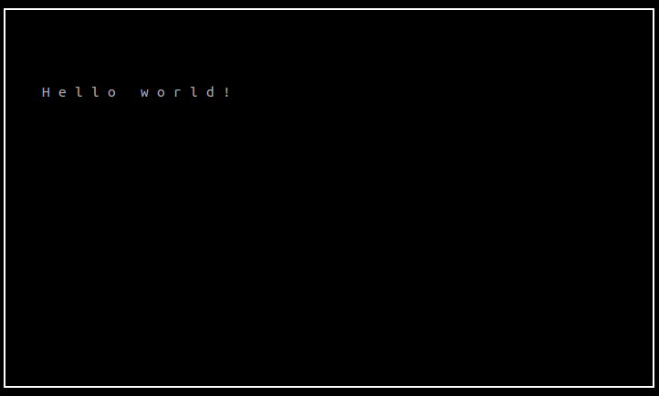

# PART 2: A player on the screen

Click [here](../part1) in case you missed part 1.

---
### 2.1: Moving things around a little
To prepare for the rest of the project, we will now prototype some function headers for our game source. 

In a new file called `src/game.h`, we add:
```c++
int init();
void run();
void close();
```
Along with standard compilation checks.  (Add these on your own.)

Now, we will put things in their proper place - in a new file called `src/game.cpp`:

```c++
#include <string>
#include <ncurses.h>

#include "game.h"

WINDOW* wnd;

int init() {
    wnd = initscr();
    cbreak();
    noecho();
    clear();
    refresh();

    return 0;
}


void run() {

    move(5, 5);

    std::string text = "Hello world!";
    for(size_t i = 0; i < text.size(); i++) {
        addch(text[i]);
        addch(' ');
    }

    refresh();

    while(1);
}


void close() {
    endwin();
}
```
Note that this is just code copy-pasted from our original main function.  
We also added a pointer to a `WINDOW`, to save our current ncurses window context.

We go back to main and replace it with:

```c++
    int init_status = init();

    if(init_status == 0)
        run();

    close();

    return 0;
```
We can also remove all includes, and add `#include "game.h"`.  
You should now write a makefile target for `game.cpp`. 
You can borrow [our example makefile](./makefile) for this.

The project should now behave the same as our Hello World program from last section.
There are several things to note:

<!-- NOTE: sentences need to be on one line in a bullet list -->

- First off, we are structuring the main and quiz code in a way that makes sense to both object-oriented and functional approaches.  If you wish, you can make game.h a class - the function `init()` can then be easily rewritten as a constructor, and `close()` a destructor.

- It is important to note the role of main.cpp.  Its purpose will be to parse command line input and pass the data along to the game, which will adjust accordingly.  This compartmentalizes code that would be very cluttered otherwise.  However, you are still welcome to use any approach you are comfortable with.

- Also note that we avoid using any special types in game.h, to avoid having redundant includes in .cpp files that don't need them.  The same goes for variables and structs - never declare them in your header!

---
### 2.2: Getting started for real

Let's finish up our initialization procedure.

Add the following snippets to `init()`, in `game.cpp`:

```c++
    /** clear(), refresh() **/

    keypad(wnd, true);
```

This option enables ncurses to interpret action keys, rather than print out escape sequences.
([man page](http://linux.die.net/man/3/keypad))

```c++
    nodelay(wnd, true);
```

This disables blocking when using [`wgetch()`](http://linux.die.net/man/3/wgetch).
It's important if we want to animate something while still listening for input.
([man page](http://linux.die.net/man/3/nodelay))

```c++
    curs_set(0);
```
Simply tells ncurses to make the cursor invisible.
([man page](http://linux.die.net/man/3/curs_set))


Next, we will set up color manipulation.

```c++
    if(!has_colors()) {
        endwin();
        printf("ERROR: Terminal does not support color.\n");
        exit(1);
    }
```

The function ```has_colors()``` lets us know whether or not the terminal supports color manipulation.
([man page](http://linux.die.net/man/3/has_colors))

And last, but not least:
```c++
    start_color();
```

Enables routines that let you redefine colors within a terminal.
([man page](http://linux.die.net/man/3/start_color))


Finally, let's get something on the screen.
In `init()`:

```c++
/** start_color(); **/

    attron(A_BOLD);
    box(wnd, 0, 0);
    attroff(A_BOLD);

/** return 0; **/
```

`attron()` and `atroff()` are used to activate an attribute for drawing - in this case, to use bold type.
([more info](https://www.mkssoftware.com/docs/man3/curs_attr.3.asp))

The function `box()` and its [many variants](https://www.mkssoftware.com/docs/man3/curs_border.3.asp) are very convenient - used here to draw a frame around the window.

Go ahead and run your project now!
You should see something like this...



Let's use the `attr` functions to set the colors.
Add this block of code at the end of your initialization:
```c++
/** start_color(); **/

    init_pair(1, COLOR_BLACK, COLOR_CYAN);
    wbkgd(wnd, COLOR_PAIR(1));

/** return 0; **/
```

`init_pair()` simply takes two colors and assigns them to a number.
This number is passed into the `COLOR_PAIR` macro in various functions. 
Here it's used with [`wbkgd`](https://www.mkssoftware.com/docs/man3/curs_bkgd.3.asp) to set the background.

What you should now get is this:


Neat! Notice that the 'Hello world' text is darker than the rest - this is because we disabled the `A_BOLD` attribute earlier.
Go ahead and change the colors back to `COLOR_WHITE` and `COLOR_BLACK` respectively.

We'll come back to this later.  
For now, let's return to the header and prototype some more.

---
### 2.3: 2D vectors

At the top of your game.h:
```c++
typedef struct {
    uint_fast8_t x;
    uint_fast8_t y;
} vec2ui;

typedef struct {
    int_fast8_t x;
    int_fast8_t y;
} vec2i;

/** init, run, etc **/
```
Here we declare a `vec2ui` datatype.
2D vectors will be the foundation of our game, and we won't be using floats.

The type `uint_fast8_t` is a c++11 feature* -
basically, it asks the system to implement that value using the *fastest* available `int` size of at *least* 8 bits.
For a better explanation, see [here](http://stackoverflow.com/questions/8500677/what-is-uint-fast32-t-and-why-should-it-be-used-instead-of-the-regular-int-and-u). 
<sub> * note that this requires `<cstdint>`</sub>


`vec2i` is simply a signed version.
This means that the maximum range will be at least -127/128.  
This is OK, since our screen will be limited to 80x24.  (More on that in a bit!)

Now, we have everything we need to create our first character!

---
### 2.4: Player 1 has entered the game

A game isn't interactive if you can't control something.
Here, we will introduce our first movable element.

In the globals section of `game.cpp`:

```c++
/** WINDOW wnd; **/

struct {
    vec2i pos;
    char disp_char;
} player;

/** int init() { **/
```

Here is our simple player.
All it owns is a position and a char to represent itself.

We'll go ahead and set those right now:

```c++
/** void run() { **/

    player.disp_char = '0';
    player.pos = {10, 5};

/** } **/
```
At this point you should also delete the Hello World code in `run()`.

Now we draw our player:

```c++
/** player.pos = {10, 5}; **/

    mvaddch(player.pos.y, player.pos.x, player.disp_char);
    refresh();

    while(1);
/** } **/
```

Running the project, what we get is:


There's our player!
Let's figure out how to move it around.

---
### 2.5: Capture some keystrokes

ncurses provides a simple function, `getch`, to take one character of input at a time.
It functions almost exactly like `cin` - blocking the program until input is recieved.
However, remember that we disabled blocking using the `nodelay` function.

To demonstrate this, go back to `init()` and comment out the line with `nodelay`.

We will use a variant, `wgetch` (more on ncurses function variants later), as such:

```c++
/** player.pos = {10, 5}; **/
    int in_char;

    while(1) {
        in_char = wgetch(wnd);
        mvaddch(player.pos.y, player.pos.x, in_char);
        refresh();
    }
} // end of run()
```

As you can probably figure out, this code will draw the last character you typed to the player's position.
Note the ncurses convention of `(y, x)` coordinates!

Try this out with some different keys, especially special ones like ALT and ESC.
Neat!

Go ahead and remove the comment on `nodelay` now.
Instead, we will use a timing method to limit our infinite loop.

```c++
/**     mvaddch() **/ 

        usleep(10000); // 10 ms

/**     refresh() **/
```

Don't forget to `#include <unistd.h>` for the `usleep` function.
The value passed in is the number of microseconds to sleep for, so here we get a 10ms delay.
This value is a compromise between good response time and performance.

Now let's detect some key presses.  Modify your code to look like this:

```c++ 
/** int in_char; **/

    bool exit_requested = false;

    while(1) {
        in_char = wgetch(wnd);
        
        switch(in_char) {
            case 'q':
                exit_requested = true;
                break;
            case KEY_UP:
            case 'w':
                player.pos.y -= 1;
                break;
            case KEY_DOWN:
            case 's':
                player.pos.y += 1;
                break;
            case KEY_LEFT:
            case 'a':
                player.pos.x -= 1;
                break;
            case KEY_RIGHT:
            case 'd':
                player.pos.x += 1;
                break;
            default:
                break;
        }

        mvaddch(player.pos.y, player.pos.x, player.disp_char);
        refresh();

        if(exit_requested) break;

/**     usleep **/
```

This giant switch-case will change the character's position appropriately for each directional key.

The `KEY_UP`, `KEY_DOWN`, etc. macros are action keys defined by ncurses.
In fact, if `in_char` was just a type `char`, these would not work, since they rely on additional bits.
We also define key `q` to allow us to quit.

Try running the project now.
Does it behave as you expected?

Probably not, since the player seems to be leaving a trail behind!
Here is another insight into how ncurses works.
If a character is drawn to the screen, it will stay there until it is overwritten.
Therefore, we add this line to `run()`:

```c++
/**     in_char = wgetch(wnd); **/

        mvaddch(player.pos.y, player.pos.x, ' ');

/**     switch statement **/
```

Here we basically "white-out" the last position of the player.
This method is very performance friendly and will be used often in the future.

At last, compiling and running our project gives a result:


Awesome!
You're ready to move on to the [next section](../part3), where we will add falling objects to dodge!

___

This folder contains all source code for part 2.
