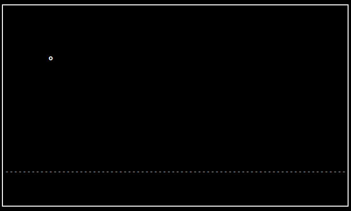
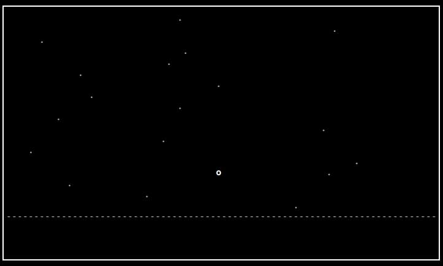
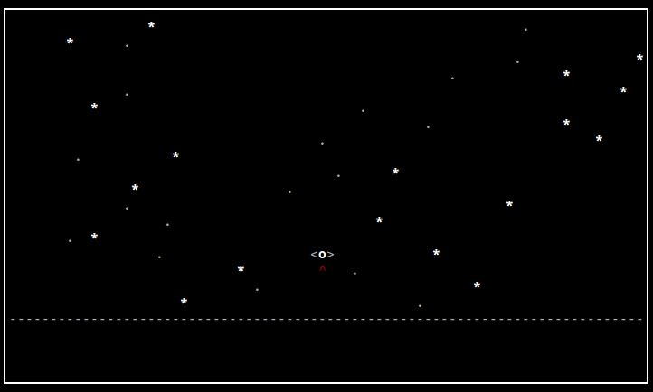

# PART 4: Multiple windows

In case you missed it, the previous tutorial can be found [here](../part3).


---
### 4.1 Multi-Windowing

This is where ncurses gets tricky.
This section will focus largely on refactoring our old code to use the window system.

However, it's not all boring - we will also make a starry background, asteroids that the player can hit, and a spaceship!

When your game has separate "areas", such as a score display and the main game area, it's a good idea to update and operate on them separately.
That way, if your move the player, the entire screen won't need updating - just the game area.

Lucky for us, ncurses has a clever way of doing just that!

At the top of your `game.cpp`, replace your globals with:

```c++
/** includes **/

WINDOW* main_wnd;
WINDOW* game_wnd;

rect game_area;
rect screen_area;

vec2ui cur_size;

ObjectField asteroids;
ObjectField stars;

struct {
    vec2i pos;
    rect bounds;
    char disp_char;
    int energy;
} player;
```

This will set the stage for what we'll add later.

From now on, we will assume the game size will always be the default terminal size - 80x24, or 80 characters by 24 rows.

Let's begin by rewriting `init()`:

```c++
int init() {

    srand(time(0));

    main_wnd = initscr();
    cbreak();
    noecho();
    clear();
    refresh();

    curs_set(0);

    start_color();

    screen_area = { { 0, 0 }, { 80, 24 } };

/** see next snippet **/
```

The only new lines here are the random seeding at the top and defining screen area at the bottom.
80x24 is the default size of any terminal.
Note that our coordinates are still in the `(x, y)` format here.

Moving on, we add:

```c++
/** see previous snippet **/

    int infopanel_height = 4;
    game_wnd = newwin(  screen_area.height() - infopanel_height - 2, 
                        screen_area.width() - 2, 
                        screen_area.top() + 1, 
                        screen_area.left() + 1  );
    main_wnd = newwin(screen_area.height(), screen_area.width(), 0, 0);

    game_area = { { 0, 0 }, { screen_area.width() - 2, screen_area.height() - infopanel_height - 4 } };

/** see next snippet **/
```

Here we are defining the bounds of our two windows using the function `newwin`.
[(man page)](http://linux.die.net/man/3/newwin)

The bounds are defined by simple counting, and as you can see, `game_wnd` excludes the borders that will be around the screen area (hence the `- 2`).

```c++
/** see previous snippet **/
   
    // useful color pairs
    init_pair(1, COLOR_WHITE, COLOR_BLACK);
    init_pair(2, COLOR_GREEN, COLOR_BLACK);
    init_pair(3, COLOR_YELLOW, COLOR_BLACK);
    init_pair(4, COLOR_RED, COLOR_BLACK);
    init_pair(5, COLOR_BLUE, COLOR_BLACK);
    
    // enable function keys
    keypad(main_wnd, true);
    keypad(game_wnd, true);
   
    // disable input blocking
    nodelay(main_wnd, true);
    nodelay(game_wnd, true);

    // test for color here

    return 0;
}
```

Here, we simply define several useful color pairs, and setup the `keypad` and `nodelay` functions as before.
However, they need to be called for both windows now.

At this point, we find that our program needs a total overhaul.  
Therefore, we must rewrite our `run()` function, using the new two-window framework:

```c++
void run() {

    int tick;

    // initialize player as before

    // constrain object fields to game area
    asteroids.setBounds(game_area);
    stars.setBounds(game_area);

    int in_char = 0;
    bool exit_requested = false;
    bool game_over = false;
    
/** see next snippet **/
```

This is not much different from our original code, but helps in the refactoring process.

```c++
/** see previous snippet **/
    
    // draw frame around whole screen
    wattron(main_wnd, A_BOLD);
    box(main_wnd, 0, 0);
    wattroff(main_wnd, A_BOLD);

    // draw dividing line between game and stats
    wmove(main_wnd, game_area.bot() + 3, 1);
    whline(main_wnd, '-', screen_area.width() - 2);

    // initial draw
    wrefresh(main_wnd);
    wrefresh(game_wnd);

/** see next snippet **/
```

Here, we finally draw the outlines of the windows we defined earlier!
The screen now consists of a frame around the edge, and a horizontal dividing line near the bottom.
This divides our screen into the game area and the score area.

Continuing into the main game loop:
```c++
/** see previous snippet **/

    tick = 0;
    while(1) {

        // clear game window
        werase(game_wnd);

        // read inputs, lowercase all characters
        in_char = wgetch(main_wnd);
        in_char = tolower(in_char);

        // controls switch statement goes here
    
/** see next snippet **/
```

Now, we take advantage of the multi-windowing setup, and are now able to clear the game screen every execution.
This prevents us from having to "white-out" the trail behind every moving object!
Also, since the frame and score have been drawn previously, they will remain persistent.

```c++
/** see previous snippet **/

        // player ship main body
        wattron(game_wnd, A_BOLD);
        mvwaddch(game_wnd, player.pos.y, player.pos.x, player.disp_char);
        wattroff(game_wnd, A_BOLD);

        wrefresh(main_wnd);
        wrefresh(game_wnd);

        if(exit_requested || game_over) break;

        tick++;

        usleep(10000); // 10 ms
    };
}
```

Here we close up our game loop with drawing the character, refreshing each window separately, and performing our tick + sleep step.
Note that we changed the `mvaddch` function to `mvwaddch()`, which takes in a window as a first argument.
Many ncurses functions follow this naming scheme.

Now run the project.
You should notice the frames are drawn around each area as they should be!
Since linux's default terminal size is 80x24, if you start a new terminal with default size, the frame around the game should fit precisely.



Notice what happens when the player moves to a position on the frame.
Here are some questions to ask yourself:

- Which character gets drawn, the player or the frame?
- How does this compare to the behavior after you finished the last part?
- What makes this happen, in terms of our windowing system?

We are ready to implement bounds checking now.
The player needs to stay within the game, after all!

---
### 4.2 Bounds checking

There are many ways to keep a position within some set bounds.
There is a useful function in `cmath` called `clamp` that provides a simple and portable interface to do this.
For this example, though, we'll implement it using conditional statements.
We'll also have some fun, and map movement to emulate vim!

Change your switch statement for controls to look like this:

```c++

        /** getting input **/

        switch(in_char) {
            case 'q':
                exit_requested = true;
                break;
            case KEY_UP:
            case 'w':
            case 'i':
                if(player.pos.y > game_area.top())
                    player.pos.y -= 1;
                break;
            case KEY_DOWN:
            case 's':
            case 'k':
                if(player.pos.y < game_area.bot() + 1)
                    player.pos.y += 1;
                break;
            case KEY_LEFT:
            case 'a':
            case 'j':
                if(player.pos.x > game_area.left() + 1)
                    player.pos.x -= 1;
                break;
            case KEY_RIGHT:
            case 'd':
            case 'l':
                if(player.pos.x < game_area.right() - 2)
                    player.pos.x += 1;
                break;
            default:
                break;
        }

        /** player drawing **/
```

This is pretty self-explanatory.
We also leave 1 character on each side of the player - you'll see why in a bit!
There are downsides to hard-coding offset values, but it's okay in this case.

If you run the project, you'll see that the player is indeed constrained to the area outlined by the frame.

---
### 4.3 Stars

This part is very simple.
We are going to add a moving background that does not affect the player, just like in part 3.
However, it will also be constrained to the new game window.

In `game.cpp`, right after our controls switch:

```c++
    /** switch statement **/

    if(tick % 7 == 0)
        stars.update();

    for(auto s: stars.getData())
        mvwaddch(game_wnd, s.getPos().y, s.getPos().x, '.');

    /** player drawing **/
```

That was easy!
The code we wrote in [part 3](../part3) does most of the work.
We simply define the update to happen every 70 ms, and draw each star as a period.

This is a simple example of modular programming - you rely on your previous implementations to take care of the "busy work", and have peace of mind to focus on higher levels of logic.



---
### 4.4 Asteroids

It's time to add the main enemy of our game - space rocks!

Getting these to show up is easy.
Pop open `game.cpp`, and go to where we visited last section:

```c++
    /** stars update **/

    if(tick > 100 && tick % 20 == 0)
        asteroids.update();

    /** stars draw **/

    for(auto a : asteroids.getData()) {
        wattron(game_wnd, A_BOLD);
        mvwaddch(game_wnd, a.getPos().y, a.getPos().x, '*');
        wattroff(game_wnd, A_BOLD);
    }

    /** player drawing **/
```

We want them to move down five times a second, but only begin moving after one second.
This will cause a cool pause before the game begins each time it's restarted.

---
### 4.5 The spaceship

Let's take a break from programming the object fields, and finish up our character's model.
Our simplest spaceship will look like this: `<o>`

We can draw it like so, using ncurses' ACS (alt charset):

```c++
    /** player drawing **/

    wattron(game_wnd, A_ALTCHARSET);
    mvwaddch(game_wnd, player.pos.y, player.pos.x - 1, ACS_LARROW);
    mvwaddch(game_wnd, player.pos.y, player.pos.x + 1, ACS_RARROW);

    /** leave an empty space for the next snippet **/

    wattroff(game_wnd, A_ALTCHARSET);

    /** asteroid drawing **/
```

This will draw the character's spaceship parts on the sides, using an offset from the player's current position.
Since we left spaces in our collision code earlier, the sides will not exit the game area.

Now, let's add a fun feature - in the space we left open, add this:

```c++
    if((tick % 10) / 3) {
        wattron(game_wnd, COLOR_PAIR(tick % 2 ? 3 : 4));
        mvwaddch(game_wnd, player.pos.y + 1, player.pos.x, ACS_UARROW);
        wattroff(game_wnd, COLOR_PAIR(tick % 2 ? 3 : 4));
    }
```

Run the project - what you should see is a flickering engine flame!
We are using simple arithmetic on the `tick` value to change the flame character's color over time in a simple animation.

You will find that little things like these add life and depth to our simple game, even while the player is doing nothing.

Here's a screenshot of the result:


---
### 4.6 Collisions

Let's hit some asteroids!

Now that we have our ship, we can define the player's full bounds.
After the controls switch in `run()`:

```c++
    /** stars and asteroids update **/

    player.bounds = { { player.pos.x - 1, player.pos.y }, { 3, 1 } }; // player is 3x1

    /** see next snippet **/
```

This will update our bounds after each move in the game loop.
Recall that we write a `contains` function for our `rect` type earlier.
Since the player's bounds are a `rect` and every asteroid is a `vec2i`, we can write a simple linear collision detection algorithm:

```c++
    /** see previous snippet **/

    for(size_t i = 0; i < asteroids.getData().size(); i++) {
        if(player.bounds.contains(asteroids.getData().at(i).getPos())) {
            asteroids.erase(i);
        }
    }

    /** drawing backgrounds and player **/
```

Try running the project now - this will make asteroids "disappear" when hit by the player!



Congratulations!
In the [next tutorial section](../part5), we will create a user interface, and introduce more game mechanics.

---

This folder contains all source files for part 4.
