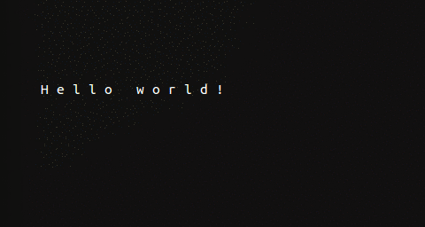

# PART 1: Starting out with ncurses

### 1.1: A brief introduction of everything

History goes here


### 1.2: Getting comfortable in our format
This project will follow a standard structure which you should already be familiar with.
All source code belongs in `src`, and all binary files are generated in `bin`.
Let's start by creating a file, src/main.cpp:

```c++
#include <ncurses.h>

int main(int argv, char** argc) {

    return 0;
}
```

Note the inclusion of the header `ncurses.h`.  
This is required to use the features we will rely on later.

Add a simple makefile:

```Makefile
bin/main: bin/main.o
        g++ -g -o bin/main bin/main.o -std=c++11 -Wall -pedantic -lncurses

bin/main.o: src/main.cpp
        mkdir -p bin
        g++ -g -c -o bin/main.o src/main.cpp
```

This will become more complex with stuff like macros as our project grows, but for now it's good enough.
Note that we're compiling using c++11, and also note the g++ `-lncurses` flag at the link stage - this makes sure we can use the proper library with our executable.

Try to `make` the project now. 
If you encounter an error related to the library, this probably means it's not installed.
You'll need to run `sudo apt-get install libncurses5-dev` (or the latest compatible version) to get it on your machine.  

*note to ucr students on hammer: this may not compile with cs100 settings active*


### 1.3: Getting started with ncurses

Adding the following code to our main function:
```c++
    initscr();
    cbreak();
    noecho();
    clear();
    refresh();

    while(1);
```
and compiling + running `bin/main` results in a blank screen.  Here we see several important effects:
- keyboard buttons pressed are not output to the screen
- ending the program with ctrl-c returns the terminal to its previous state

This is important because a simple call such as printf("\033c") or system("clear") would modify the terminal and its history - but here, ncurses takes control and reserves it for us.
See [here](http://hughm.cs.ukzn.ac.za/~murrellh/os/notes/ncurses.html#init)
and [here](http://tldp.org/HOWTO/NCURSES-Programming-HOWTO/helloworld.html)
for detailed explanations of these functions.

We are now ready for our obligatory "Hello World"!

### 1.4: Hello terminal

Before our infinite loop, we add this code to the main:
```c++
move(5, 5);

std::string text = "Hello world!";
for(int i = 0; i < text.size(); i++) {
    addch(text[i]);
    addch(' ');
}

refresh();
```

The `move(5, 5)` command moves the cursor to the specified ```(y, x)``` position.
Remember, curses is built entirely on this character-oriented coordinate system.

Next, a simple for loop will invoke `addch()`twice - once to print the text char, and once to print a space.  
`addch()` will print a character at the current cursor position, and advance it by 1 space.

*Don't forget to `include <string>`!*

Finally, it is important to call `refresh()` whenever any changes made should show up on the screen.
Any changes using curses will not show up until you call this function.


#### Final product



We are now ready to start building our game!  
[Part 2](../part2) of the tutorial series deals with the basic structure of our project.


This folder contains all project files for part 1.
