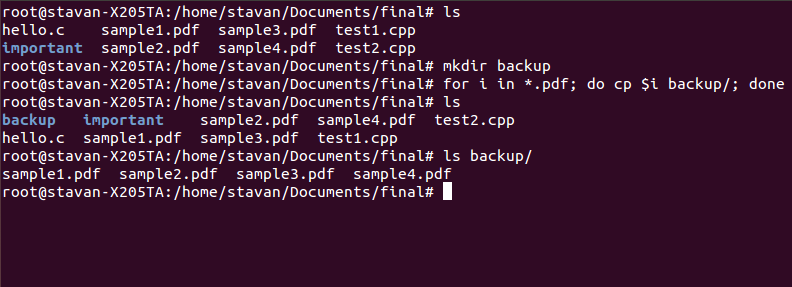
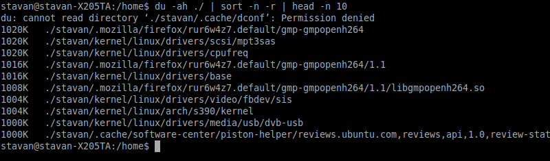
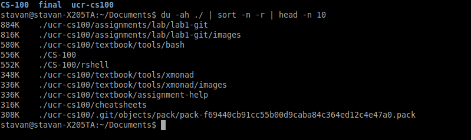
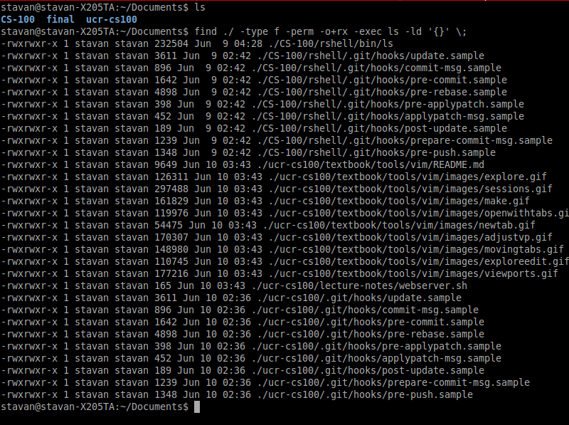
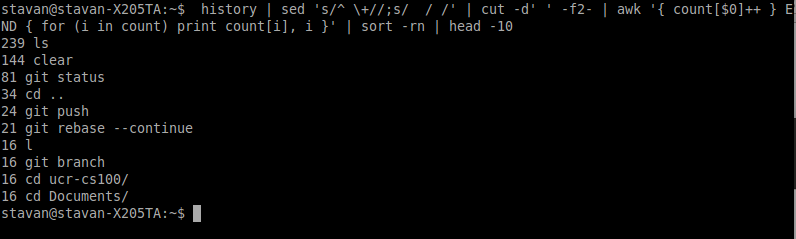
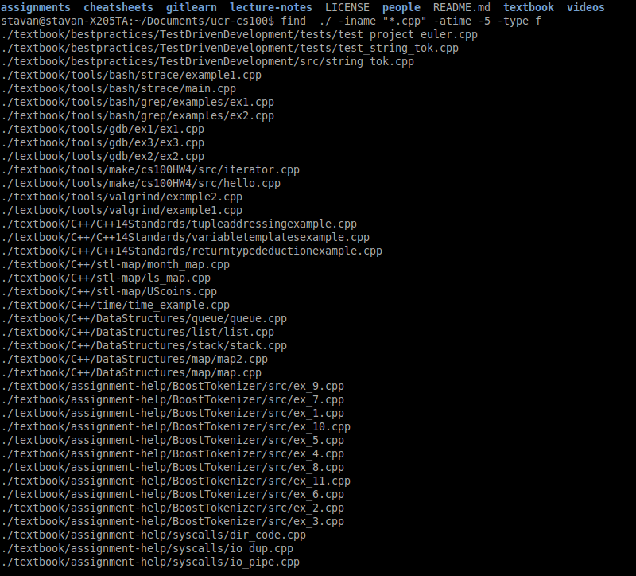
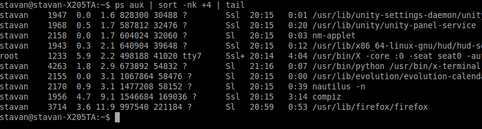

#8 Fascinating and Useful Bash One-liners#

##1. Create a copy of all pdf files into a directory called backup.
    $ for i in *.pdf; do cp $i /backup; done

The for loop is a powerful command. Check out this [link](https://www.garron.me/en/articles/bash-for-loop-examples.html) to learn more about its application in bash.

In this example above we are iteratively going through the current working directory and finding all pdf files. 
Each pdf files will get copied into the folder backup. 
Here is an alternate way of looking at it:
    
    for each pdf in [current working directory]
        do
            cp pdf into /backup
    done

After getting a thorough understanding check out these examples.

##2. Display largest ten files in current directory and subdirectories.

    $ du -ah ./ | sort -n -r | head -n 10

Why? 
This command can help you find the largest program or file in your computer!

How it works: `du` reports the sizes of directory trees including all their subdirectories and files.
Then `sort` and `head` clean it up by sorting according to the numeric size and displaying the top 10 files.

`du` parameters: 
* `-a` flag lists all directories and files.
* `-h` converts into human readable format

`sort` parameters: check out the man page for [sort](http://www.lehman.cuny.edu/cgi-bin/man-cgi?sort+1)

`head` parameters: check out the man page for [head](http://unixhelp.ed.ac.uk/CGI/man-cgi?head)

Here are two examples:

-On a home directory

-On Documents directory

Meaning of the two outputted columns:

    Column 1: Displays files size in human readable format

    Column 2: Displays full path from given starting point.

##3. Find all executable files in the current directory and subdirectories
    $ find ./ -type f -perm -o+rx -exec ls -ld '{}' \;

Here we have `find` with the parameter `type f` passed in which is basically searching for a file.
The rest of parameters `-perm -o+rx -exec` specify that we are looking for an executable.
Finally `ls -ld` will output the detailed information associated with the file.

Here is an example:

##4. Print your top 10 most frequently used bash commands
    $ history | sed 's/^ \+//;s/  / /' | cut -d' ' -f2- | awk '{ count[$0]++ } END { for (i in count) print count[i], i }' | sort -rn | head -10

You'll see an output similar to this:

Meaning of the two outputted columns:

    Column 1: Displays number of times that particular command was executed

    Column 2: Displays the actual command that was run.
    
##5. Find the list of `.cpp` files that were accessed in the last 5 days
    $ find ./ -iname "*.cpp" -atime -5 -type f
    
Again, `find` get passed in the parameter `iname` to ignore the search for the query that ends in `.cpp`
`atime` gives the accessed time of the file.
And as seen before, `type f` searches for a file.

Summing it all up, we get an output:

    
##6. Display the top 10 memory intensive processes on your computer
    $ ps aux | sort -nk +4 | tail

Why? Determine which programs are slowing down your computer.

Similar to #2, the command above prints out, in descending order, the top 10 processes that are utilizing the memory.

How?
Here we have `ps` which prints out the processes that are currently running in `bash` and `aux` adds more specificity to it.

`a` - show processes for all users

`u` - display the process's user/owner

`x` - also show processes not attached to a terminal

So, if you are running other programs outside the terminal, `aux` will catch it.

Here is an example:

##7. Grab files from a remote server to your local machine
    $ scp your_username@remotehost.edu:foobar.txt /some/local/directory

Why? 

1.scp is a wonderful bash one-liner for transferring files back and forth from server to local and local to server.

2.scp is an alternate way to quickly grab files from a server without having to have knowledge of git.    

To go the other way (local to server), format is as follows:
    
    $ scp /some/local/directory/file.txt your_username@remotehost.edu:/home/location/files

##8. Execute a command at midnight
    $ echo cmd | at midnight

