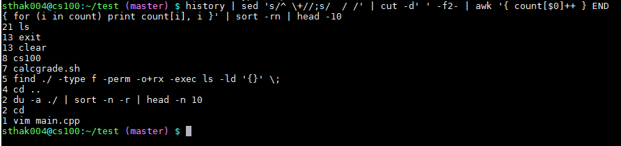
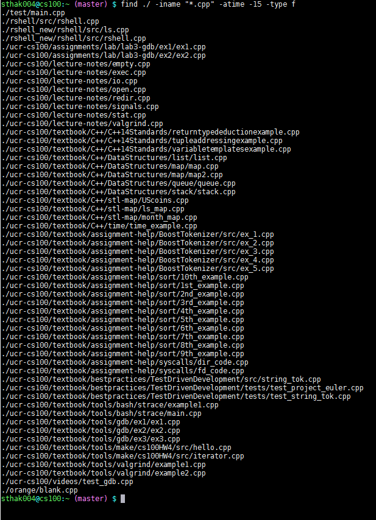

#8 Fascinating and Useful Bash One-liners#

Here are 8 useful bash one-line commands. 

These commands are extremely versatile in that a LOT of these commands can be substituted with all files types, directories, etc.

##1. Create a copy of all pdf files into a directory called backup.
    $ for i in *.pdf; do cp $i /backup/; done

You aren't limited to only `.pdf` files!
For example, you could replace, the `.pdf` extension with whatever your heart desires:

    $ for i in *.txt; do cp $i /backup/; done
    $ for i in *.md; do cp $i /backup/; done
    $ for i in *.cpp; do cp $i /backup/; done

The same applies for the folder where these backup files are stored. You can place them in an already existing folder or a newly created one that will be made when you run the command.

Here we are iteratively going through the current directory in search for `.pdf` files. If a `.pdf` file is detected, then it 

The `*` symbolizes anything before it is completely fine.

Here the for loop is iteratively searching through the current directory for `.pdf` files. 

Part B)

    do cp $i /backup/;
Here it is taking the found `.pdf` file and copying it directory into the backup folder.

Here we take

Part C)

    done
    
Finally it completes the process with the `done` command.

##2. Display largest ten files in current directory and subdirectories.

    $ du -a ./ | sort -n -r | head -n 10

Something hogging your computer hard drive space? Need to figure out what it? 

Run the above command, but before you do it, change to your home directory. The command search will start in the current directory so changing to your home directory will search the majority of your filesystem.

In other words, run

    $ cd; du -ah ./ | sort -n -r | head -n 10
    

Here, `cd` will take you to your home directory. **then** you will run the command allowing you to retain the one-liner aspect.

The flags: 
* `-a` flag lists all directories and files.
* `-h` converts into human readable format

Here is the command in action:

![hog] (images/Capture3_HW4.PNG)

As you can see, the total number of bytes the file takes up is listed in the left column.

##3. Find all executable files in the current directory and subdirectories
    $ find ./ -type f -perm -o+rx -exec ls -ld '{}' \;

Combining `ls` and `find` commands along with some flag parameters, we can generate a list of executable files that exist within the current and subdirectories.

##4. Print your top 10 most frequently used bash commands
    $ history | sed 's/^ \+//;s/  / /' | cut -d' ' -f2- | awk '{ count[$0]++ } END { for (i in count) print count[i], i }' | sort -rn | head -10
    
What commands are you typing the most?
If you're anything like me, you'll see a lot of `ls` and `clear`. 
Find out your most frequently typed bash commands by using the one-liner listed above.

You'll see an output similar to this:

    
##5. Find the list of `.cpp` files that were accessed in the last 5 days
    $ find ./ -iname "*.cpp" -atime -5 -type f
    
Feel like someone snooped through your computer lately? What if they stole some of your code?! 

No worries! We can use the command listed above to determine which files were accessed in the past 10 days!
Here is a sample output:

    
##6. Display the top 10 memory intensive processes on your computer
    $ ps aux | sort -nk +4 | tail

Similar to #2, the command above prints out, in descending order, the top 10 processes that are utilizing the memory.

Just like google chrome, there can be many other programs that are slowing down your computer.

##7. Grab files from a remote server to you local machine
    $ scp your_username@remotehost.edu:foobar.txt /some/local/directory
    

To go the other way (local to server), format is as follows:
    
    $ scp /some/local/directory/file.txt your_username@remotehost.edu:/home/location/files

scp is a wonderful bash one-liner for transferring files back and forth from server to local and local to server.
scp is an alternate way for one to transfer files back and forth without having to use git.
So it is great one-line command for those who are unfamilar with git and/or don't have the time to learn it.

##8. Execute a command at midnight
    $ echo cmd | at midnight

