#How to use CS100 Runtests

This walkthrough will familiarize you with the basic features and usages of ``cs100-runtests``.

First, start cs100 runtests as such:
```
./cs100-runtests bin/rshell exampleFolder/exampleTestCaseFile
```

You will see the [Vim Pane](#the-vim-pane) to the left, the [Shell Pane](#the-shell-pane) to the upper right, and the [Runtests Controller Pane](#the-runtest-controller-pane) to the lower right. 
The controller will let you know if you test case file was successfully loaded, and print out the commands available.

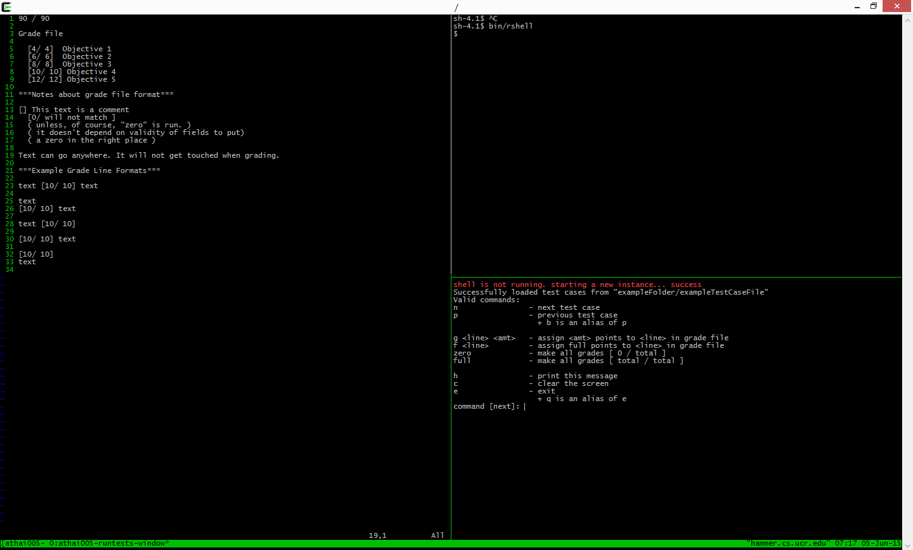

First we will step through one test case. Type ``n`` or ``next`` and press Enter. 
The first test case should be run, and the result printed in the Shell Pane.

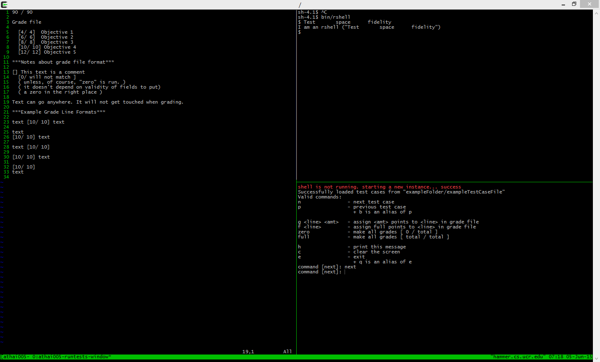

Step through another test case by just pressing ``Enter``. 
This utilizes the previous command repeating feature. 
If no commands are specified, pressing ``Enter`` will run the previously entered command.

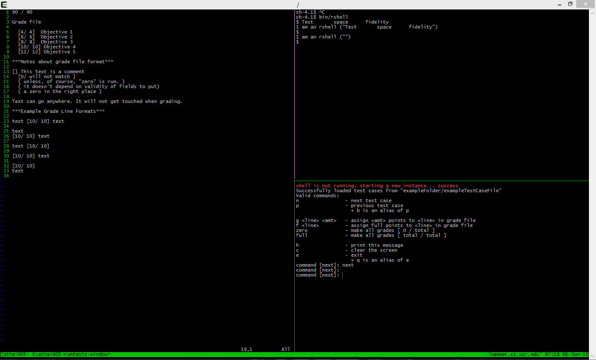

Now let's try running previous test cases. 
Type in ``p`` or ``previous`` and hit ``Enter`` as many times as you would like. 
Notice that the controller prints an error message when you attempt to run more test case commands after you reach the very first one.

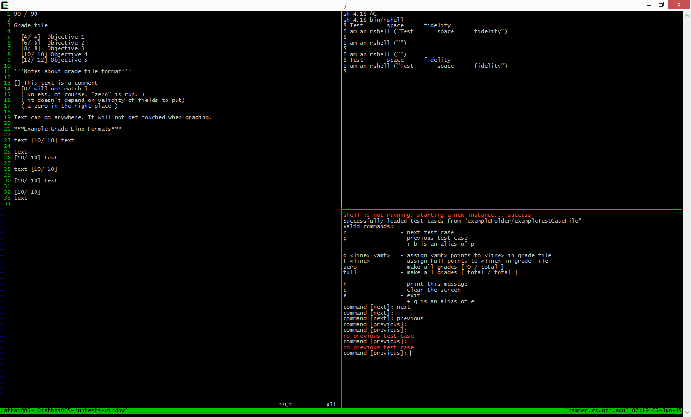

Let's step forward four times (``next``). 
Be sure to take advantage of the previous command repeating feature. 
Now step through one more test case and...

You'll notice that our ``bin/rshell`` has finished executing. 

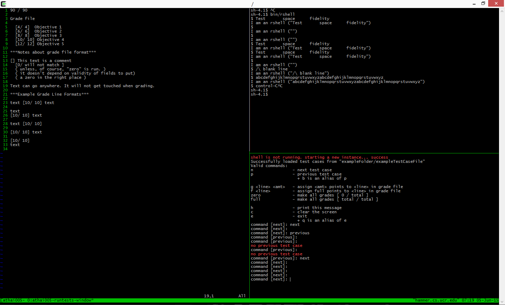

There is no need to quit and restart ``cs100-runtests`` when this is encountered. 
Simply run the next test case and ``cs100-runtests`` will restart ``bin/rshell``. 
You will also be notified that ``bin/rshell`` has been restarted.

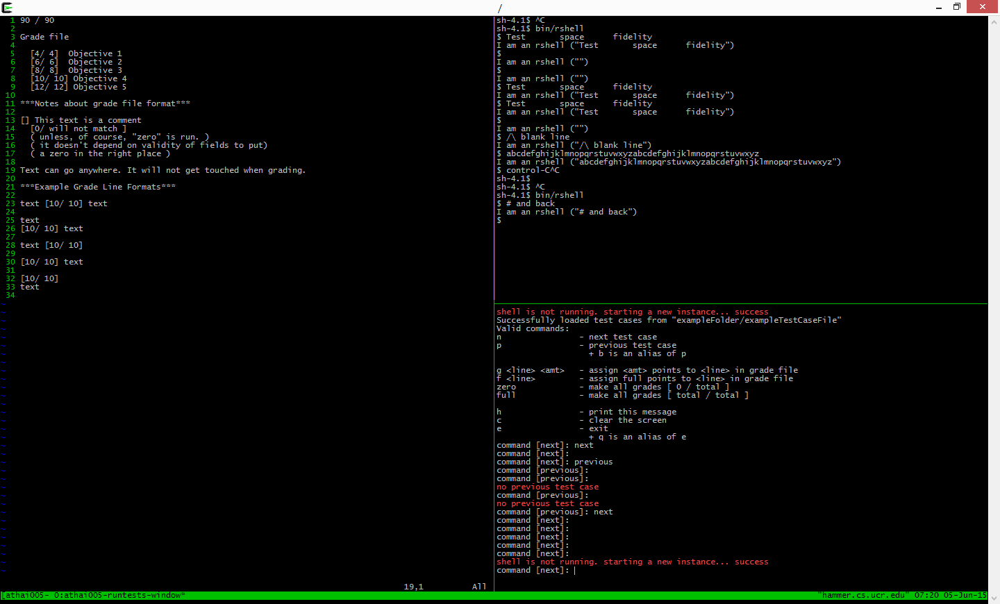

Step through the next test case. This one backgrounds the shell.
Fortunately, ``cs100-runtests`` is able to use job control to bring back the stopped process.
Try the last case, and you will see that ``cs100-runtests`` has foregrounded the program.

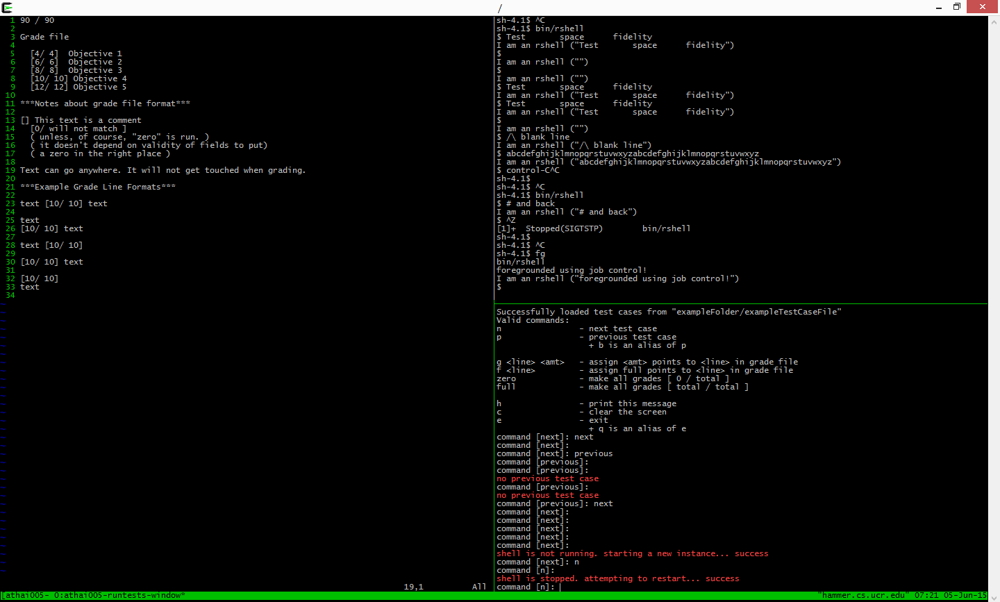

Now that we have run out of test cases, let's try to run more. 
Step forward as many times as you would like to. 
The controller prints out an error notifying you that you have run out of test cases.

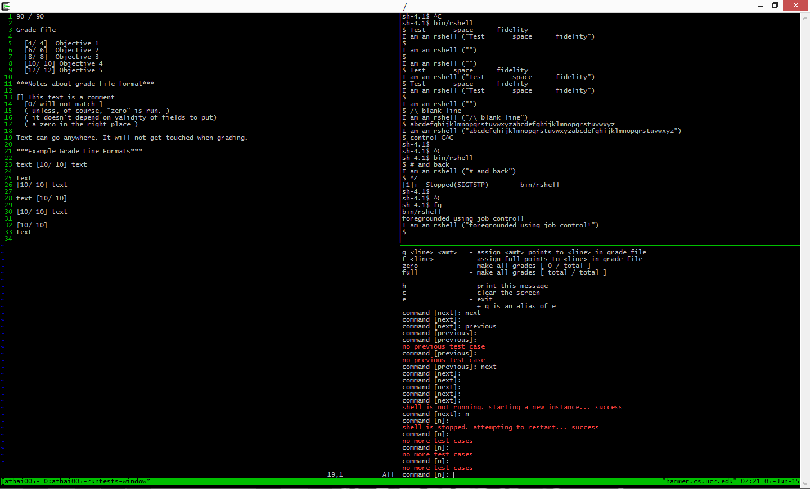

Now that we have finished testing the ``shell``, let's grade it. 
Grading can happen at any time while you're using ``cs100-runtests``.
First, zero out all of the grades by entering ``zero`` in the controller pane. 

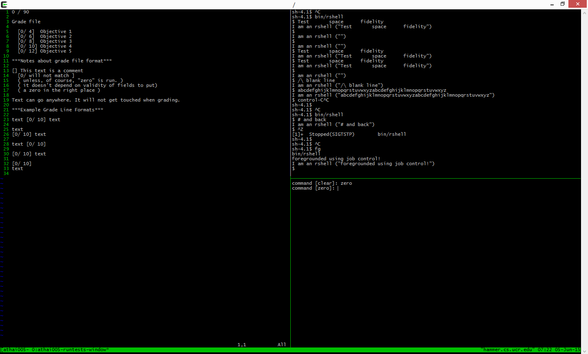

Let's say the student earned full credit for the objectives on lines 5 and 7.
To enter their grades, type in:
```
f 5
f 7
```
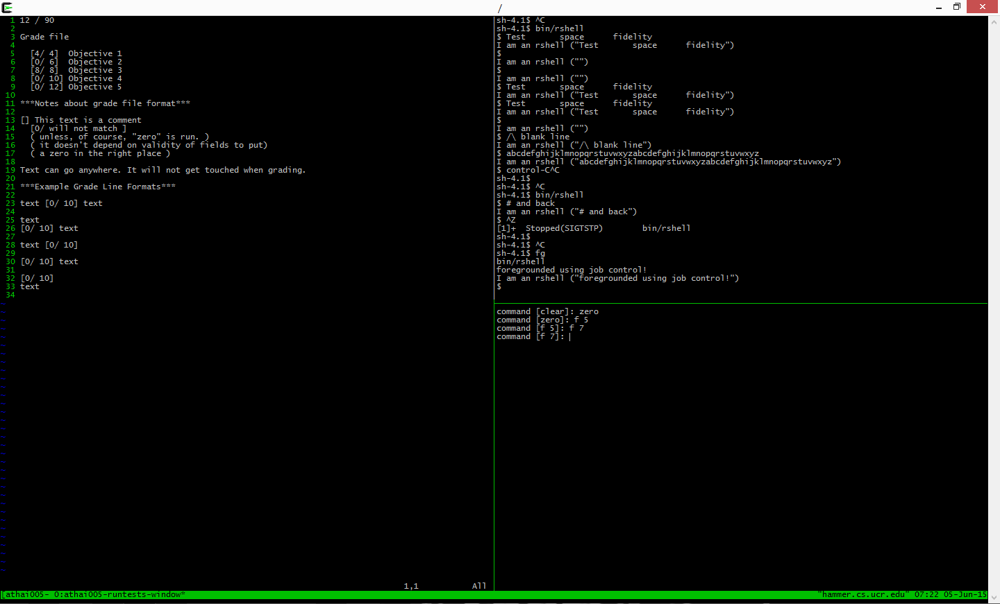

Perhaps they received 4 points for the objective on line 6:
```
g 6 4
```
And received 11 points for the objectives on lines 8 and 9:
```
g 8 11
g 9 11
```
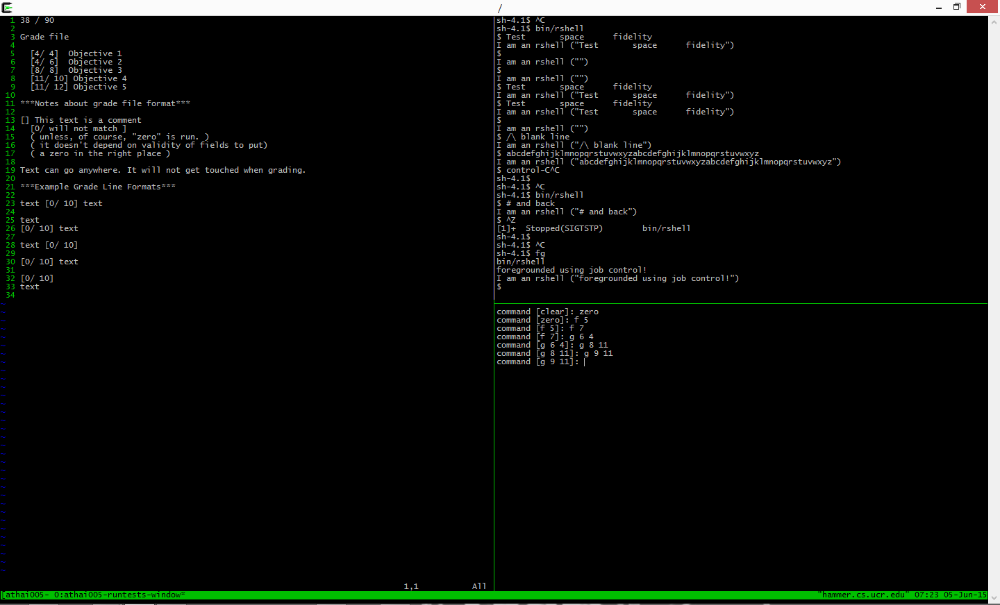

If you wanted to give a full grade for every objective on every line, run ``full``.

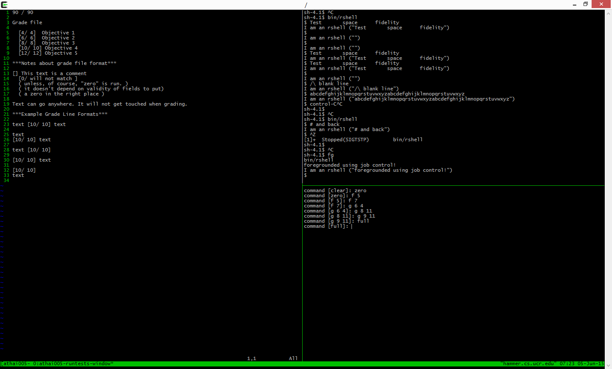

Now that we are done testing and grading ``bin/rshell``, type ``exit`` and hit ``Enter`` to stop running ``cs100-runtests``.

Congratulations. You now know the basic features of ``cs100-runtests``.


##A more detailed explanation
``cs100-runtests`` is a script that can be used by students to test their programs, and by TAs to grade student programs.

To start runtests:

```
cs100-runtests <program> <testcasefile>
```
where ``<program>`` is the path to the program you want to test (e.g. ``bin/rshell``, ``sh``, ``bash``, etc.) 
and <testcasefile> is the path to the file containing all of the test cases you would like to use on your shell.
These parameters are optional, as runtests will default to ``bin/rshell`` if no shell is entered, and it is possible to load a test case file within the program after the script has been run.

Three panes are created when ``cs100-runtests`` is started.
The lower right pane is the [Runtests Controller Pane](#the-runtests-controller-pane).  
The left pane is the [Vim Pane](#the-vim-pane).  
The upper right pane is the [Shell Pane](#the-shell-pane).  

###The Runtests Controller Pane
The Runtests Controller Pane is where all controls will be entered.
If no test case file is specified when running the script, you can manually load a test case file in from this pane.
Properly formatted test case files contain each individual test case on a separate line.
(see the sample test case files in ``/exampleFolder/sampleTestCases``)

The Runtests Controller Pane is controlled with the following commands:
* ``c`` or ``clear`` clears the controller screen.
* ``e``, ``exit``, ``q``, or ``quit`` ends the program.
* ``h`` or ``help`` prints a small help message detailing the controls for ``cs100-runtests``.
  * ``h?``, ``?h``, ``?``, and ``??`` also print the help message.


###The Vim Pane
The Vim Pane contains an open grade file that is located in the current directory. 
If a grade file does not already exist, a blank file is opened, and you will have to create your own grade file.
The proper format for a line in a grade file would be 
```
[0/<# of points possible>]
```  
The grade file is automatically saved upon exit.
For examples of properly formatted grade files, see the sample grade files in ``/exampleFolder/sampleGradeFiles``.  
For more information about ways to format the grade file, see the sample grade file provided in the current directory.


The Vim Pane is controlled with the following commands:
* ``g <line> <amount>`` or ``grade <line> <amount>`` places the amount entered as a grade on the line entered.
* ``f <line>`` places a full score on the entered line. 
  * Nothing happens when these commands are entered if ``<line>`` is not a properly-formatted grade line.
* ``zero`` makes all grades 0.
* ``full`` makes all grades maximum.

###The Shell Pane
The Shell Pane is where the user input ``<program>`` (or default ``bin/rshell``) is started.

The Shell Pane is controlled with the following commands:
* ``n`` or ``next`` runs the next test case loaded from the test case file.
* ``p``, ``previous``, ``b``, or ``back`` runs the previous test case loaded from the test case file.
  * Note: Pressing enter following a ``next`` or ``previous`` command will repeat it.
* ``l <testcasefile>`` or ``load <testcasefile>`` loads ``<testcasefile>`` into ``<program>``, discarding previously loaded test cases.

