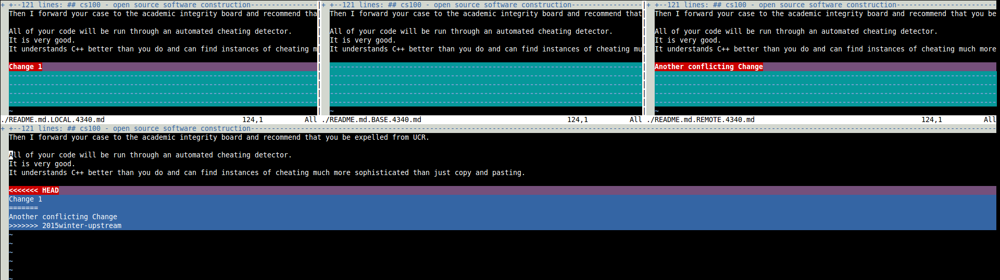

In this guide we will go through setting up a cloned git repository to update it
from a remote repository. At the same time we will be establishing a git
workflow that keeps our local repository up to date with a remote repository.

Note: All text with `<TEXT>` means to replace TEXT with the proper
text/path/name

Start by cloning the class repository from your student github account. From
there checkout the `2015winter` branch, then create and checkout a branch named
`2015winter-student`

##Uploading and downloading changes

 Now that we have cloned the git repository
we should probably set it up for `pushing` and `pulling` from a remote that has
the changes we want. We will use the class project hosted on github. The url is
https://github.com/mikeizbicki/ucr-cs100.git 

##Git Remote

First to pull from a location that is not in your forked repo you will
have to add a remote, a place to download/upload changes from. To view the
current remotes for the repo issues the `git remote` command

	$ git remote

Notice their is nothing in this output bu the remote named origin. This is the
default remote for a cloned repo.  This will generally be your personal fork of
a repo. Now Lets add a remote so that we can 'pull' from our remote reposity.
This can be done by telling `git remote` to add a remote. We do this by passing
the 'add' argument to git remote. After that argument we pass the name of the
remote to add and the url to associate with that remote name. git remote add
\<remote name\> \<url\>

	$ git remote add upstream https://github.com/mikeizbicki/ucr-cs100.git

Lets view our remote again. 
	
	$ git remote

This doesnt give us much information, just the names agian. This time though the
remote named 'upstream' wa there.  At least we have something to off of. To get
a little more detail about the remote use the -v flag 

	$ git remote -v

This gives both the remote names as well as their push/push url associated with
that remote. Why is their a seprate url for both push and pull? That is because
each can be set seperate for a remote. We might want to do this when we have
forked a remote repository that we do not have push access to. So we set it to
pull from the upstream repository and push to our remote. To to this we can use
the 'set-url' option of git remote. Later in the guide an local upstream branch
will be created, this how you may want to manage your remotes.

	$ git remote set-url --push [remote] [name of push repo] $ git remote
set-url --push upstream https://github.com/<your username>/ucr-cs100.git

###Git push

Since our repository was cloned it had a remote named origin that we can now
push the changes to github using 'git push'
	
	$ git push <remote> <branch>
	$ git push origin 2015winter-student

This does not set up tracking of the remote branch though. To do that you can
set the remote tracking branch during the push. What is a tracking branch. A
tracking branch is local branch that has been setup to watch a remote branch.
This mean that commands like `git pull`, and `git push` already know what branch
and remote to push/pull to/from without specifing either. To do this we can just
push our branch while passing the -u flag.

	$ git push -u origin 2015winter-student

Now you may be asking why you didnt have to add the remote for the upstream
remote but not the origin remote. Well when you cloned a repository using git
clone, a remote is set up automatically called origin that is set to the url you
cloned from.

There you go, now you can get a already created repo, you can push changes to
the repo, and add remotes.  You may be wondering, 'How do I get changes from
others that commited on the project'. More importantly how can we get the
project we want. 

###Fetching a remote repository

 Now that you can create, and push changes to
your own git repo its time to learn how grab external changes.  Assuming that
you have been following the guide up to this point, you have commited to your
cloned repo from lab1, you have added a remote and set up a traking branch. I
will now show how to pull in changes that others have commited while you were
away. To do this set up a remote to the repository that you wish to update from.
In our case we update from the classes main repo. This is ussualy called the
upstream repo but can be called anything you like.

	$ git remote add <remote name> <url>

So no we have two remotes. One to our own repository and one to the original
repository. Lets get a copy of the upstream version but let's not make any
changes to ours just yet. This is done using the 'fetch' git command. This
command downloads a copy of the named remote with everything necessary to
complete its history. This information is stored in `FETCH_HEAD`.  Lets go ahead
and fetch the remote upstream repository.

	$ git fetch
 
Wait a minute this didn't fetch our `upstream` remote, it grabbed the remote
named `origin`. It did this because there is no remote specified. When there is
no remote specified the remote origin will be used as a default, unless it is
configued differently. To grab another remote other than the one named `origin`
we will specify the remote to be fetched.

	$ git fetch <remote> git fetch upstream

Lets get onto the upstream 2015winter branch.  To verify the branch is there
first run git branch with the -r (remote) option passed

	$ git branch -r

The branch is there

	$ git checkout upstream/2015winter

You should see something similar to this message. Don't be alarmed its just
telling us that we are not on a branch and the changes we make wont be saved
unless we create one from this point. So if you want your changes saved you will
need to create and checkout a branch from this point, or any point before
switching to anothe branch.

		Note: checking out 'upstream/2015winter'.
		
		You are in 'detached HEAD' state. You can look around, make
		experimental changes and commit them, and you can discard any 
		commits you make in this state without impacting any branches 
		by performing another checkout.
		
		If you want to create a new branch to retain commits you create,
		you may do so (now or later) by using -b with the checkout 
		command again.
		Example:
		
		  git checkout -b new_branch_name
		
		HEAD is now at e3a3a63... Merge branch '2015winter' of
		https://github.com/mikeizbicki/ucr-cs100 into 2015winter

The little checkout message is preciesly the command we
will use to create our local branch. We are doing this to simulate that there are 
changes happeing upstream. Some that will affect us later or else there is no
need to create the local upstream branch.

	$ git checkout -b 2015winter-upstream

This is how we use fetch to create a remote branch in any repository. This can
be used in many more places though.  We can use it to grab any remote branch and
create a new local branch named what we want.

###Preparing for a merge 

Now that you know how to use fetch to get remote
branches into you repo lets update our local student branch.  Before you update
the local branch its a good idea to check for changes make upstream against your
own branch. To do that we will use git log again, this time passing a revision
instead of a single brach. This will give us the difference in commits, if there
is no difference there will be no commits to display.
	
	$ git log <branch name>..<branch name> where <branch name> also be a
<remote/branch>

	$ git log 2015winter-student..2015winter-upstream

Okay so now we know that there are commit differences so lets check them out
visually. We can use git diff for this

	$ git diff <branch name> <branch name>
	
	$ git log 2015winter-student 2015winter-upstream

Depending on how many commit differences there the could be a lot of files
changes. This can give you an idea of the state of changes against your current
repo. I think its time to merge this upstream branch into our. Lets play it safe
on work on a temporary student branch. 
	
	$ git checkout 2015-student 
	$ git checkout -b 2015winter-stutmp

Lets merge our upstream into the -stutmp branch(we are currently on it)
	
	$ git merge <branch name> 
	$ git merge 2015winter-upstream

Edit the merge commit so it will reflect what you want. Most times the
merge commit message is enough if it is generated.

If there was no commits to the main class repo then git will finish the merge
with a up to date message.  If the merge could be completed without any problems
but doesn't just update our branch pointer, then git merge will use a merge 
strategy. Most merge messages will inform you that recursive strategy was used. 
If the merge finishes witout any problems there will be a fast-forward. This is
where the branch pointer just gets updated to merge branch pointer.

To illustrate this point checkout the 2015winter-upstream branch, make a change
to the README.md, then commit that change. Next checkout the 2015winter-stutmp 
branch and make a change to README.md again. Make it at the same place but
 make it a different change. This time we should have a problem when we merge.

	$ git merge upstream/2015winter

You should get a message similar to

>Auto-merging README.md CONFLICT (content): Merge conflict in README.md
>Automatic merge failed; fix conflicts and then commit the result.

Last time you saw a merge conflict you dealt with it manually, this time let's
use some tools to help us along. When editing a few files that you have been 
working on merge tool might not help that much. When managing a larger repo
with many confilcts, such as when updating a custom android ROM codebase
against the google version or against cyanogenmod. Mergetool can help to address
this issue by presenting a editor that displays the merge commits. No longer
do you need to go and find the `<<<<<<<======>>>>>>>` in the files. Mergetool opens up
to these locations in the given file. 

###Finishing your merge using mergetool

	
With our repository waiting to have the merge conflct fixed we can run git
mergetool. This starts a test editor to help deal with the changes. 
	
	git mergetool

>This message is displayed because 'merge.tool' is not configured.
See 'git mergetool --tool-help' or 'git help config' for more details.  'git
mergetool' will now attempt to use one of the following tools: meld opendiff
kdiff3 tkdiff xxdiff tortoisemerge gvimdiff diffuse diffmerge ecmerge p4merge
araxis bc3 codecompare emerge vimdiff Merging:
>

In my case vimdiff was the automatically selected mergetool. In any case when
the tools open up their will genrally be three windows.  The window labled
`*.REMOTE` is the file to be merge from the remote repository. The `*.LOCAL`
file is the local file with upstream changes being merged into and the 
`*.BASE` file is the common base to base files. This means that it doesn't 
contain either changes from the local or remote repos. These programs genrally
let you view all the files at once letting you visually inspect the code 
between them simultaneausly.

In this case vimdiff opens four windows with the bottom one being the actual file
we are working on, the one we will want to save.  

Once you resolve these merge confilcts save the files and run git commit to 
finish the commit
	
	git commit

Notics the commit mesage tells you what files had a confict. Dont forget to edit
the commit now if you want to remove the conflict notice. In our case lets edit 
message to use `2015winter-student` instead of `2015winter-stutmp`

There are many mergetools that can be used. A common one that is used in a 
GUI is meld which is on the list of tools git knows about.  To use another
tool that is not configured for automatic use pass mergetool the -t (--tool)
flag and the name of the tool.

	$ git mergetool -t meld

Meld will bring up a GUI based mergetool to help you finish the merge.  Lets
bring our student branch up to date.
	
	$ git checkout 2015winter-student 
	$ git merge 2015winter-stutmp

Notice this time a merge isnt actually performed, rather a fast-forward of 
the student branch is performed, so now the student branch is up to date 
with the stutmp branch. We can now delete the stutmp branch

	$ git branch -d 2015winter-stutmp

###Skip the mess, let's just pull 

Up to this point 'git remote' was used to add remotes to a repository, 
'git fetch' was used to grab those repo's, 'git merge' was used to merge 
those repo's, 'git meregtool' was used to resolve the confilcts if any. 
Well that seems like an awful lot to update a repository. Thankfully there is 
a command to do most of that work for us. It is `git pull`. Though this does 
not follow the prevois steps exeactly, it does perform a 'git fetch' followed
by a 'git merge'. Assume that there are commits on the upstream remote branch 
named `2015winter` that we do not have. 

	$ git pull <remote> <branch> 
	$ git pull  upstream 2015winter

This will fetch and merge just like we did manually before. 
If results in the a merge conflict again we can use mergetool like we did
last time. It may not always be the case that we want to deal with merge
conflicts. Is there a way let would make it so pulling will only accept
histories that are 'fast-forwards' to the branch. To to this we pass the 
--ff-only flag to git pull

	$ git pull --ff-only [remote name]

This stops git from performing the merge if there are merge conflicts. 

###Rebasing your local branch

 Using the last few commands results in a merge commit since they are not 
fast-forwards.  To make sure you changes are always on top of the upstream 
repository we use rebase.  Just because rebasing a branch
linearizes the history does not mean merge conflicts will not occur. Instead when
rebase encounters a merge conflict when reapplying your commit on top of the new 
base, when it does it will let you fix 'your' commit that is being applied. 
To use rebase the command is `git rebase` and the branches to rebase.

	$ git rebase [branch]

For this exercise you will need to rewind your student branch to before the merge commit,
this is the commit we made the change to README.md at. Use git log for this. We don need 
all that extra information in the log just the commit hash and the commit name. Lets use 
`git log --pretty` to format the output for easier veiwing

	$ git log --pretty=oneline

Lets checkout the commit before the merge. Create a local branch from this detached head
and call it 2015winter-rebase. Since we already have the changes on both branches lets 
go ahead an rebase our changes onto our upstream branch. 

	$ git rebase 2015winter-upstream

This command should result in a merge conflict. This time the merge conflict happened
when we applied our commit on top of the upstream commit. The will be a notice of which
files had the conflict and this message

	
	When you have resolved this problem, run "git rebase --continue".
	If you prefer to skip this patch, run "git rebase --skip" instead.
	To check out the original branch and stop rebasing, run "git rebase --abort".

These are the options when in a rebase. The --continue flag is used to signal to 
git that you are done editing the source files for the conflicts. It will then finish
apllying that commit. The --skip option tells git to for go this commit and not incluse 
it at all. The --abort flag is used to stop the rebase completly without apllying any
commits to the base branch.

If you check out the history there is no longer a merge commit. Instead your change is 
the newest commit. Take a good look at these commits. The commit that we just 
rebased onto the upstream branch has the same commit time as when we originally commited
it. Not really this is the original author commit time, but not the rebase commit time.
When we rebase we change the history of the tree. Rebase keeps the orignal author for the 
commit but updates the commit author and time. We can view this using `git log` again 
using the `--pretty=fuller` option 
	
	$ git log --pretty=fuller

Now we see that the commit has the time we actually commited it at as well as the time
that it was first commited at. Caution should be used when rebasing. If you rebase and 
push these changes to github it will deny the push even if the files all appear the same.
This is because github defaults to fast-forward pushes. This prevents someone from changing
the history from uder someone. If the central location changes beacause of a rebase, all
forks are now out of sync with the main repo. So take caution when using rebase and refrain
from forcing a rebase if possible.

## So long and thank for all the fish

These simple git commands allow us to establish a workflow. We have already seen three 
throughout this guide.Though a mergetool is not nessicery it can be useful and was used in 
all the workflows in this guide. The first was usign `git fetch` and `git merge` to manually 
merge remote repositories into our own. The second was  not dealing with `git fetch` and 
`git merge` manually but instead just using `git pull` to invoke these commands for us. 
Finally we used `git rebase` to move our commit on top of the upstream branch. This had 
the affect of modifying the commit time and author but not the actual commit author 
themselves.  Using these workflow you can keep your repo up to date. If you like a linear
history you can use the rebase based workflow. Its a little harder to perform consitently
but results in a straight git tree. Using the fetch/merge or pull options results in merge
commits for the git repo. Depending on whether or not you want merge commits is up to you.

	

