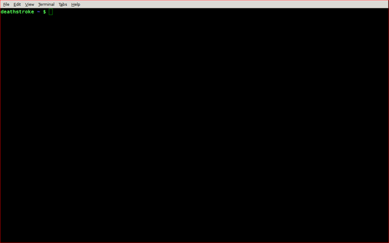
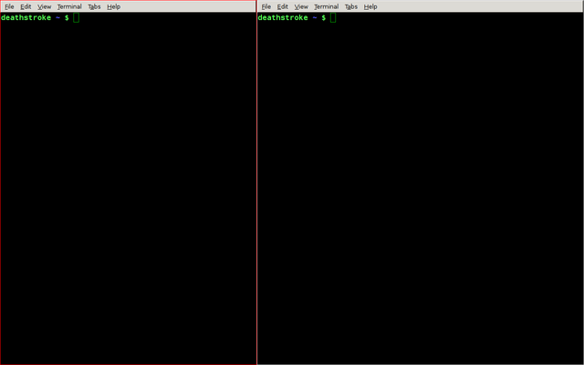

#XMonad in 2 minutes

Tired of using the mouse to drag or resize windows. Xmonad comes to the rescue. In one line, Xmonad is a tiling manager that makes efficient use of screen space.

##Installation

For debian based distros, fire up your terminal and enter `sudo apt-get install xmonad`

For others, users should follow [this link](http://xmonad.org/intro.html) 

It will ask you for your password and then prompt for a verifcation with a yes/no question. Enter y and wait for a few seconds.

Xmonad can be used in two ways

1. Setting it as your default tiling manager in your current environment( by editing the ~/.xinitrc file ).
2. Running the xmonad environment.

For a beginner, I recommend using the second method, and that is the one I will be going over in this tutorial.

##Preparation
After the installation has finished, **log out** the current session. **Do not shutdown**. I mean, you can if you want to, but then you would have to power on again.

Now at the login screen, there will be a way to change your default environment. Like a dropdown or bullet-check or something.

For debian users, it will be a dropdown under you login name field. 

For ubuntu users, it will be the round item to the right of your username.

From there choose the default environment to be xmonad. Now this will be the default environment for all future instances until you change it.

##Usage

###Opening a terminal window
When you login, you will see a blank screen.

Now, the command to run the terminal is **MOD-SHIFT-N**. MOD is by default the alt key, but it can be changed. So, basically, you will press alt, shift and n at the same time to run the terminal.

*On pressing MOD-SHIFT-N*

As you can see the terminal fills the screen completely. Lets see what happens when run run another terminal.

*MOD-SHIFT-N again*

A new terminal window opens up, but the two windows do not overlap and utilize the screen space most efficiently. This is the beauty of XMonad. 

*On pressing MOD-SHIFT-N for the third time.*

As you can see, you can open as many things as you want and there would be no overlaps or blank spaces.

###Changing the focussed window.
To cycle through other windows clockwise press **MOD-TAB** or **MOD-J**.
To cycle anticlockwise press **MOD-K**
 

###Closing the terminal
To close a focussed window press **MOD-SHIFT-C**

After *MOD-SHIFT-C*, the screen will look like

###Change current window size

You can change a window size by shifting the middle divider.

To move the divider left or right, press **MOD-H** or **MOD-L** respectively.

After pressing *MOD-H* a couple of times.

###Changing window display mode

By default the windows will be viewed in the tall mode. There are other modes besides this. 

For e.g the wide mode in which the terminals are split by a horizontal line instead of a vertical line. To change view mode press **MOD-SPACE**

There is also a single window mode, in which a single window occupies the screen, but you can cycle through other windows by pressing MOD-TAB.

*Wide Mode*

###Switch Workspace

In the xmonad environment, you will have 9 workspaces, which can be accessed using **MOD-1** to **MOD-9**.
This comes in real handy when you are working on something and suddenly you need to do something else. Instead of closing your current setup, you can just switch to a different workspace and come back later.

###Special

Since you are eventually going to need to run the control center to set up wifi etc, I decided to put the command here.

To open **system settings** in terminal, run `gnome-control-center`.

Ubuntu user should run `unity-control-center`.

###Personalizing Xmonad

Xmonad is very flexible in personlizations. You can add many things including new keyboard shortcuts, addons etc.

To configure you have to edit the `~/.xmonad/xmonad.hs`file. All the programming takes place in haskell. For a good configuation click [here](https://www.haskell.org/haskellwiki/Xmonad/Config_archive/John_Goerzen's_Configuration)
This configuration also adds other useful tools like xmobar to your environment, which will further increase your efficiency.

Feel free to contribute.